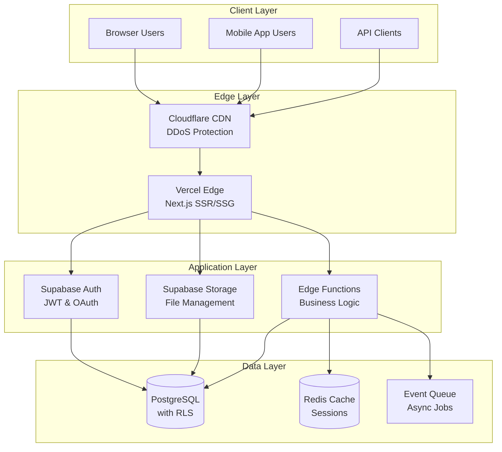
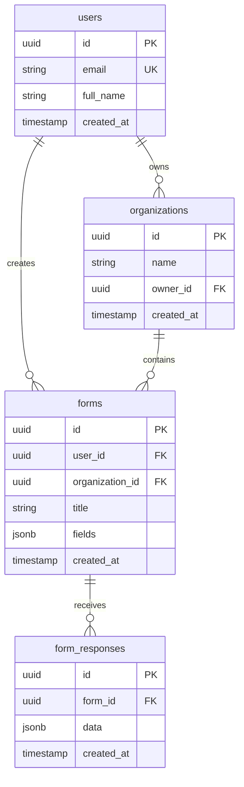
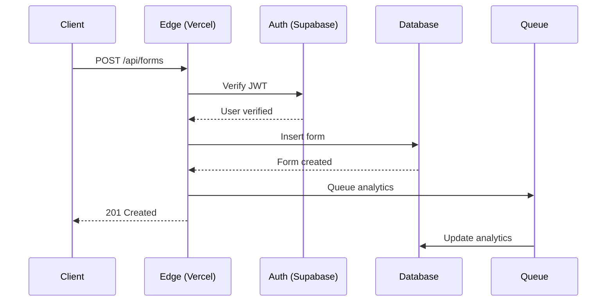
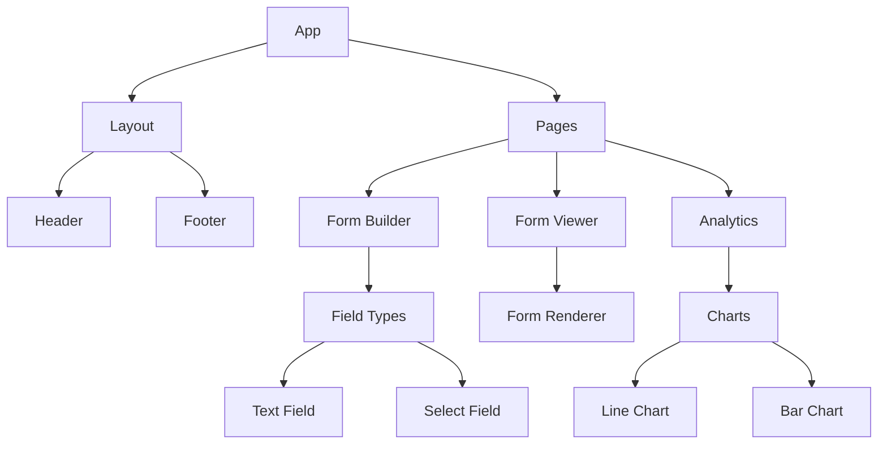
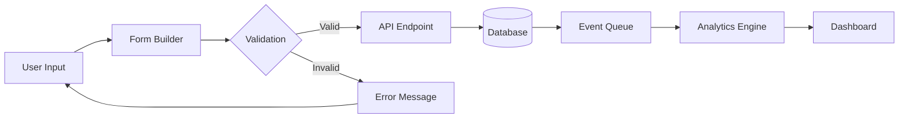
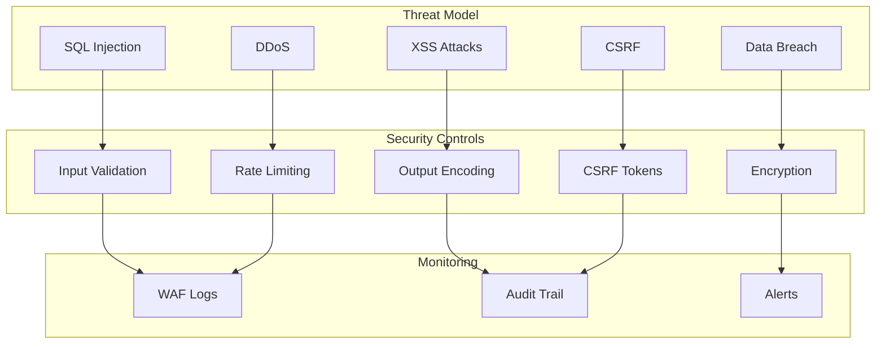

# Architecture Visualization

Generate visual representations of your system architecture using ASCII diagrams and Mermaid syntax.

## Usage

```bash
/architecture-viz [type] [--format]
/viz-arch         # alias
/av               # short alias
```

## Options

- `type`: What to visualize (system, database, api, components, flow, security)
- `--format`: Output format (ascii, mermaid, both) - default: both

## Visualization Process

I'll analyze your architecture documents and generate visual representations. Let me use the system architect to help create accurate diagrams:

```bash
# Use specialized architect for visualization
/spawn system-architect "Create visual representations of the architecture"
```

### 1. System Overview Visualization

**ASCII Diagram:**
```
┌─────────────────────────────────────────────────────────────────────────┐
│                           System Architecture                            │
└─────────────────────────────────────────────────────────────────────────┘

     ┌──────────────┐         ┌──────────────┐         ┌──────────────┐
     │   Browser    │         │ Mobile App   │         │   API Client │
     │   (Users)    │         │   (Users)    │         │  (External)  │
     └──────┬───────┘         └──────┬───────┘         └──────┬───────┘
            │                        │                         │
            └────────────┬───────────┴─────────────┬──────────┘
                         │                         │
                         ▼                         ▼
                 ┌───────────────────────────────────────┐
                 │          Cloudflare CDN               │
                 │    (Static Assets & DDoS Protection)  │
                 └───────────────┬───────────────────────┘
                                 │
                                 ▼
                 ┌───────────────────────────────────────┐
                 │           Vercel Edge                 │
                 │      (Next.js Application)            │
                 │  ┌─────────────────────────────────┐ │
                 │  │   Pages    │   API    │   ISR   │ │
                 │  └─────────────────────────────────┘ │
                 └───────────────┬───────────────────────┘
                                 │
                    ┌────────────┴────────────┐
                    │                         │
                    ▼                         ▼
         ┌──────────────────┐      ┌──────────────────┐
         │  Supabase Auth   │      │ Supabase Storage │
         │  (JWT & OAuth)   │      │  (File Upload)   │
         └──────────────────┘      └──────────────────┘
                    │                         │
                    └────────────┬────────────┘
                                 │
                                 ▼
                 ┌───────────────────────────────────────┐
                 │         Supabase Database             │
                 │         (PostgreSQL + RLS)            │
                 │  ┌─────────────────────────────────┐ │
                 │  │ Users │ Forms │ Results │ Audit │ │
                 │  └─────────────────────────────────┘ │
                 └───────────────┬───────────────────────┘
                                 │
                    ┌────────────┴────────────┐
                    │                         │
                    ▼                         ▼
         ┌──────────────────┐      ┌──────────────────┐
         │  Redis Cache     │      │   Event Queue    │
         │  (Session/Data)  │      │ (Async Process)  │
         └──────────────────┘      └──────────────────┘
```

**Mermaid Diagram:**


### 2. Database Schema Visualization

**ASCII Diagram:**
```
┌─────────────────────┐       ┌─────────────────────┐
│      users          │       │    organizations    │
├─────────────────────┤       ├─────────────────────┤
│ id (uuid) PK        │       │ id (uuid) PK        │
│ email               │       │ name                │
│ full_name           │◄──────┤ owner_id FK         │
│ created_at          │       │ created_at          │
└─────────┬───────────┘       └─────────────────────┘
          │ 1:N                          │ 1:N
          ▼                              ▼
┌─────────────────────┐       ┌─────────────────────┐
│      forms          │       │   form_responses    │
├─────────────────────┤       ├─────────────────────┤
│ id (uuid) PK        │       │ id (uuid) PK        │
│ user_id FK          │◄──────┤ form_id FK          │
│ title               │       │ data (jsonb)        │
│ fields (jsonb)      │       │ created_at          │
└─────────────────────┘       └─────────────────────┘
```

**Mermaid ER Diagram:**


### 3. API Structure Visualization

**ASCII Tree:**
```
/api
├── /auth
│   ├── POST   /login         → User authentication
│   ├── POST   /logout        → End session
│   ├── POST   /register      → Create account
│   └── GET    /me            → Current user
├── /forms
│   ├── GET    /              → List forms
│   ├── POST   /              → Create form
│   ├── GET    /:id           → Get form
│   ├── PUT    /:id           → Update form
│   ├── DELETE /:id           → Delete form
│   └── POST   /:id/submit    → Submit response
├── /analytics
│   ├── GET    /forms/:id     → Form analytics
│   └── GET    /dashboard     → Overview stats
└── /admin
    ├── GET    /users         → List users
    └── GET    /audit         → Audit logs
```

**Mermaid Sequence Diagram:**


### 4. Component Hierarchy Visualization

**ASCII Tree:**
```
src/
├── components/
│   ├── layout/
│   │   ├── Header.tsx
│   │   ├── Footer.tsx
│   │   └── Container.tsx
│   ├── forms/
│   │   ├── FormBuilder.tsx
│   │   ├── FormRenderer.tsx
│   │   └── fields/
│   │       ├── TextField.tsx
│   │       ├── SelectField.tsx
│   │       └── DateField.tsx
│   ├── analytics/
│   │   ├── Dashboard.tsx
│   │   └── charts/
│   │       ├── LineChart.tsx
│   │       └── BarChart.tsx
│   └── ui/
│       ├── Button.tsx
│       ├── Card.tsx
│       └── Modal.tsx
```

**Mermaid Graph:**


### 5. Data Flow Visualization

**ASCII Flow:**
```
User Input ──► Form Builder ──► Validation ──► API
                                                │
                                                ▼
Dashboard ◄── Analytics ◄── Queue ◄── Database
```

**Mermaid Flow:**


### 6. Security Architecture Visualization

**ASCII Diagram:**
```
┌─────────────────────────────────────────────────────────┐
│                  Security Layers                         │
├─────────────────────────────────────────────────────────┤
│ Layer 1: Network     │ Cloudflare WAF, DDoS Protection │
├──────────────────────┼──────────────────────────────────┤
│ Layer 2: Application │ JWT Auth, CORS, Rate Limiting   │
├──────────────────────┼──────────────────────────────────┤
│ Layer 3: Database    │ RLS Policies, Encrypted Fields  │
├──────────────────────┼──────────────────────────────────┤
│ Layer 4: Monitoring  │ Audit Logs, Anomaly Detection   │
└──────────────────────┴──────────────────────────────────┘
```

**Mermaid Security Flow:**


## Integration with Architecture Workflow

This visualization command:
- Reads from your architecture documents
- Generates both ASCII (for documentation) and Mermaid (for web rendering)
- Can be included in your architecture validation process
- Helps communicate design to stakeholders
- Updates automatically as architecture evolves

## Usage Examples

```bash
# Generate all visualizations
/architecture-viz

# Just system overview
/av system

# Database schema in Mermaid only
/av database --format=mermaid

# API structure in ASCII
/av api --format=ascii

# Quick visualization after architecture update
/chain architecture-design && /av
```

## Export Options

Generated diagrams can be:
- Copied to architecture documents
- Exported as images (Mermaid)
- Included in presentations
- Used in README files
- Added to PRDs for clarity

The visualizations help ensure everyone understands the architecture before implementation begins!
