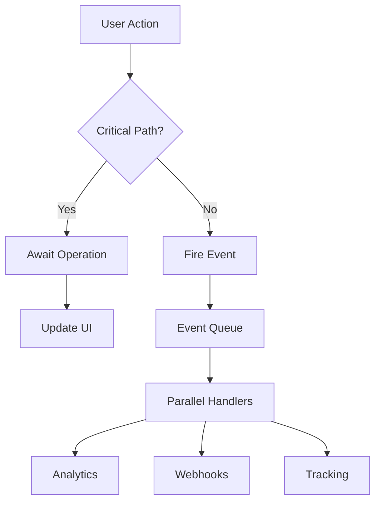

Generate async requirements section for PRD: $ARGUMENTS

Parse the PRD name from arguments and locate the PRD file.

Steps:

1. Load the existing PRD:
   - Check docs/project/features/$ARGUMENTS.md
   - Or use the provided file path

2. Analyze the PRD for async requirements:
   - Identify operations that should be non-blocking
   - Find integration points (APIs, webhooks, tracking)
   - Detect user-facing operations vs background tasks
   - Look for performance-sensitive flows

3. Generate comprehensive async requirements section:

```markdown
## Async & Event-Driven Requirements

### Event Flow Architecture



### Critical Path Operations (Blocking)
Operations that MUST complete before proceeding:

1. **Data Validation**
   - Timeout: 1000ms
   - Error Handling: Show validation errors
   - Retry: No (immediate feedback required)

2. **PII Encryption**
   - Timeout: 2000ms
   - Error Handling: Block submission on failure
   - Retry: No (security critical)

3. **Primary API Submission**
   - Timeout: 5000ms
   - Error Handling: Show error, allow retry
   - Retry: 3 attempts with exponential backoff

### Non-Critical Operations (Non-Blocking)
Operations that should NOT block user flow:

1. **Analytics Tracking**
   - Event: `lead.form.submit`
   - Priority: normal
   - Timeout: 5000ms
   - Failure Mode: Log and continue

2. **Marketing Pixels**
   - Events: Facebook, Google, TikTok
   - Priority: low
   - Timeout: 3000ms
   - Failure Mode: Silent failure

3. **Webhook Notifications**
   - Event: `lead.submission.success`
   - Priority: high
   - Timeout: 10000ms
   - Retry: 5 attempts
   - Failure Mode: Queue for later

4. **Email Notifications**
   - Event: `lead.email.send`
   - Priority: normal
   - Timeout: 30000ms
   - Failure Mode: Log for manual review

### Event Definitions

| Event Name | Trigger | Data | Priority | Handlers |
|------------|---------|------|----------|----------|
| `$FEATURE.start` | Feature initiated | `{userId, timestamp}` | normal | Analytics |
| `$FEATURE.progress` | Milestone reached | `{step, data}` | low | Progress tracking |
| `$FEATURE.complete` | Feature completed | `{result, duration}` | high | All handlers |
| `$FEATURE.error` | Error occurred | `{error, context}` | critical | Monitoring |

### Performance SLAs

- **Page Load**: < 1s (LCP)
- **Interactive**: < 100ms (INP)
- **API Response**: < 500ms (p95)
- **Total Operation**: < 3s (perceived)

### Parallel vs Sequential

**Parallel Operations**:
```typescript
await Promise.all([
  validateData(input),
  checkRateLimit(user),
  loadUserPreferences(userId),
]);
```

**Sequential Requirements**:
```typescript
const validated = await validateData(input);
const encrypted = await encryptPII(validated);
const result = await submitToAPI(encrypted);
```

### Error Recovery Strategy

1. **Graceful Degradation**
   - If analytics fail → Continue without tracking
   - If webhooks fail → Queue for retry
   - If email fails → Log for manual send

2. **User Feedback**
   - Show loading states for all async operations
   - Clear error messages with retry options
   - Success confirmation when complete

3. **Monitoring Events**
   ```typescript
   eventQueue.on('*.error', (event) => {
     monitoringService.logError(event);
   });
   ```

### Implementation Checklist

- [ ] Event queue initialized
- [ ] All handlers have timeout protection
- [ ] Critical path operations identified
- [ ] Loading states for async operations
- [ ] Error boundaries implemented
- [ ] Retry logic for critical operations
- [ ] Metrics collection enabled
- [ ] Performance budgets defined

### Testing Requirements

1. **Unit Tests**
   - Each event handler tested in isolation
   - Timeout scenarios covered
   - Retry logic verified

2. **Integration Tests**
   - Full event flow tested
   - Parallel operations verified
   - Error propagation checked

3. **Performance Tests**
   - Load testing for event queue
   - Measure operation timings
   - Verify SLA compliance

### Security Considerations

- No PII in event names or metadata
- Events sanitized before external transmission
- Webhook endpoints verified
- Rate limiting on event emission
```

4. Update the original PRD file by appending this section

5. Generate event handler stubs for identified events:
   - Create lib/events/handlers/$FEATURE/ directory
   - Generate handler files for each event type

6. Create implementation tasks:
   - Task for each event handler
   - Task for loading states
   - Task for error boundaries
   - Task for tests

Important validations:
- Ensure no PII in non-encrypted events
- Verify timeout values are reasonable
- Check that critical path is minimal
- Validate error handling strategy
