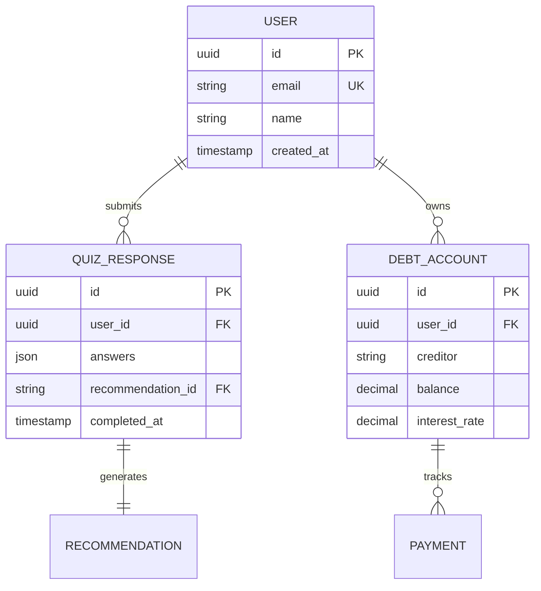
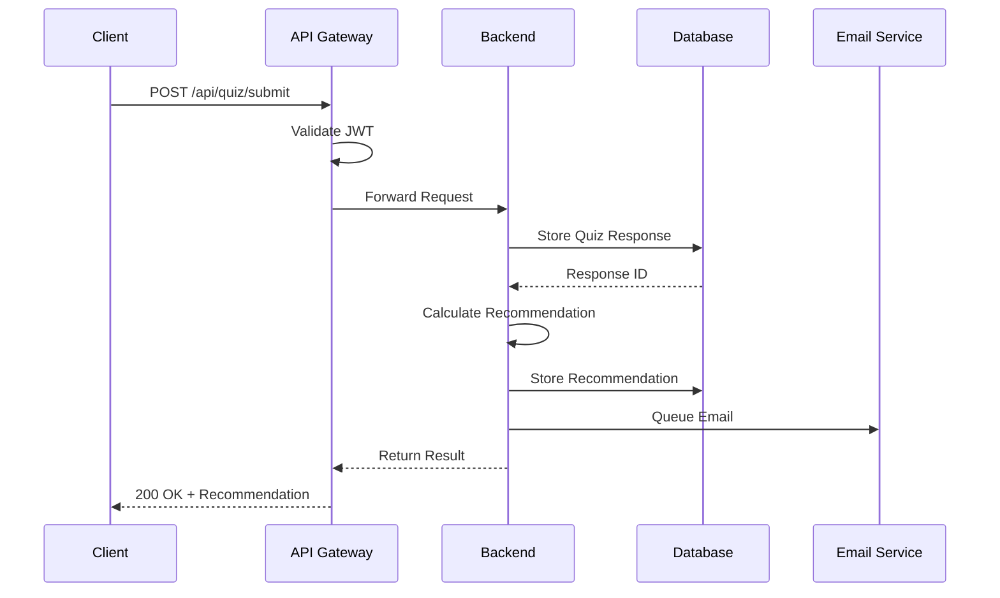

# Visualize Architecture

Generate visual representations of your system architecture using ASCII diagrams and Mermaid charts.

## Usage

```bash
/visualize-architecture [type] [--format]
/viz-arch [type]           # alias
```

## Visualization Types

### 1. System Overview (`system`)
High-level system architecture showing major components and data flow.

### 2. Database Schema (`database`)
Entity relationship diagram showing tables, relationships, and key fields.

### 3. API Map (`api`)
RESTful endpoint visualization with request/response flow.

### 4. Component Hierarchy (`components`)
Frontend component tree showing parent-child relationships.

### 5. Security Layers (`security`)
Security architecture with threat boundaries and controls.

### 6. Deployment Architecture (`deployment`)
Infrastructure diagram showing services, regions, and connections.

## Output Formats

- `--ascii` (default): ASCII art diagrams for terminal/markdown
- `--mermaid`: Mermaid diagram syntax for rendering
- `--plantuml`: PlantUML syntax for detailed diagrams
- `--all`: Generate all formats

## Examples

### System Architecture (ASCII)
```
┌─────────────────┐     ┌─────────────────┐     ┌─────────────────┐
│   Web Client    │────▶│   API Gateway   │────▶│   Backend API   │
│   (Next.js)     │     │   (Vercel)      │     │  (Supabase)     │
└─────────────────┘     └─────────────────┘     └─────────────────┘
         │                       │                        │
         ▼                       ▼                        ▼
┌─────────────────┐     ┌─────────────────┐     ┌─────────────────┐
│      CDN        │     │  Rate Limiter   │     │   PostgreSQL    │
│  (Cloudflare)   │     │   (Upstash)     │     │   (Supabase)    │
└─────────────────┘     └─────────────────┘     └─────────────────┘
```

### Database Schema (Mermaid)


### Component Hierarchy (ASCII)
```
App
├── Layout
│   ├── Header
│   │   ├── Logo
│   │   ├── Navigation
│   │   └── UserMenu
│   ├── Main
│   └── Footer
├── Pages
│   ├── Home
│   │   ├── Hero
│   │   └── Features
│   ├── Quiz
│   │   ├── QuizProgress
│   │   ├── QuizQuestion
│   │   └── QuizResults
│   └── Dashboard
│       ├── DebtOverview
│       ├── PaymentSchedule
│       └── ProgressChart
└── Components
    ├── UI
    │   ├── Button
    │   ├── Card
    │   └── Form
    └── Features
        ├── DebtCalculator
        └── RecommendationEngine
```

### API Flow (Mermaid)


## Implementation Process

### 1. Parse Architecture Documents
I'll read your architecture documents and extract:
- Component relationships
- Data models
- API endpoints
- Security boundaries
- Infrastructure topology

### 2. Generate Visualizations
Based on the extracted information, I'll create:
- Box and arrow diagrams for system overview
- Entity relationship diagrams for database
- Sequence diagrams for API flows
- Tree structures for components
- Layered diagrams for security

### 3. Output Generation
Each diagram will be:
- Saved to `docs/architecture/diagrams/`
- Embedded in relevant architecture docs
- Available in multiple formats
- Optimized for clarity

### 4. Validation
I'll ensure diagrams:
- Match written documentation
- Follow standard notations
- Are readable at different scales
- Include all key components

## Advanced Features

### Interactive Elements
For Mermaid diagrams, I'll add:
- Clickable nodes linking to documentation
- Hover tooltips with descriptions
- Styling for different component types
- Error state visualizations

### Auto-Update
The visualizations can be regenerated when architecture changes:
```bash
/viz-arch --update  # Regenerate all diagrams
/viz-arch --watch   # Auto-update on file changes
```

### Export Options
```bash
/viz-arch --export png  # Export as images
/viz-arch --export svg  # Export as vectors
/viz-arch --export pdf  # Export as PDF docs
```

## Integration

This command integrates with:
- `/validate-architecture` - Ensures diagrams match docs
- `/create-architecture` - Auto-generates initial diagrams
- `/gi PROJECT` - Includes diagrams in issue descriptions

## Expected Output

```
🎨 Architecture Visualization Generator

📊 Analyzing architecture documents...
✅ Found 6 architecture documents
✅ Extracted 12 components
✅ Identified 8 data entities
✅ Mapped 24 API endpoints

🖼️ Generating visualizations...

✅ System Overview Diagram
   Format: ASCII + Mermaid
   Saved: docs/architecture/diagrams/system-overview.md
   Components: 12 boxes, 18 connections

✅ Database Schema Diagram  
   Format: Mermaid ERD
   Saved: docs/architecture/diagrams/database-schema.md
   Entities: 8 tables, 12 relationships

✅ API Flow Diagrams
   Format: Mermaid Sequence
   Saved: docs/architecture/diagrams/api-flows.md
   Flows: 6 main user journeys

✅ Component Hierarchy
   Format: ASCII Tree
   Saved: docs/architecture/diagrams/component-tree.md
   Components: 24 UI components in 4 levels

✅ Security Architecture
   Format: ASCII + Mermaid
   Saved: docs/architecture/diagrams/security-layers.md
   Layers: 4 security boundaries

📄 Updated architecture documents with embedded diagrams

Next steps:
1. Review generated diagrams in docs/architecture/diagrams/
2. Run `/validate-architecture` to ensure consistency
3. Use diagrams in `/gi PROJECT` for clearer issues
4. Share diagrams with team for review

💡 Tip: Install Mermaid plugin in your IDE for live preview!
```

## Benefits

Visual architecture diagrams:
- Improve understanding for all team members
- Catch design issues early
- Enable better architectural discussions
- Serve as living documentation
- Help onboard new developers

Use this command after `/create-architecture` to make your technical design crystal clear!
