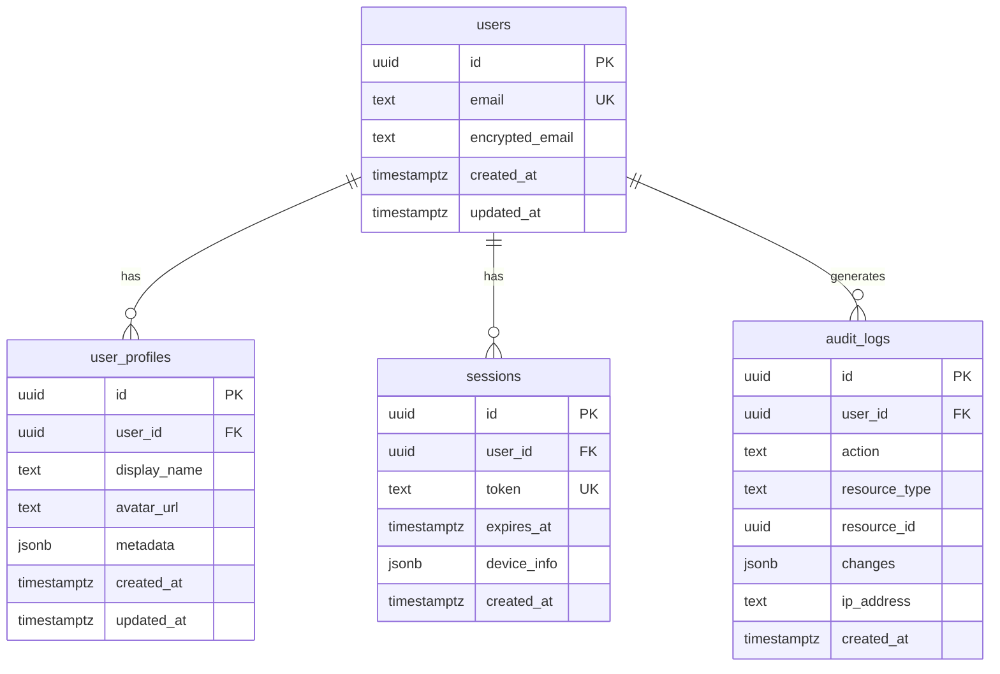

# Database Schema - [Project Name]

## Overview

This document defines the complete database schema including tables, relationships, indexes, and RLS policies.

## Schema Diagram



## Tables

### Core Tables

#### users
Primary user account information with PII encryption.

```sql
CREATE TABLE public.users (
    id UUID PRIMARY KEY DEFAULT gen_random_uuid(),
    email TEXT UNIQUE NOT NULL,
    encrypted_email TEXT NOT NULL, -- For PII protection
    created_at TIMESTAMPTZ NOT NULL DEFAULT NOW(),
    updated_at TIMESTAMPTZ NOT NULL DEFAULT NOW()
);

-- Indexes
CREATE INDEX idx_users_email ON public.users(email);
CREATE INDEX idx_users_created_at ON public.users(created_at DESC);

-- RLS Policies
ALTER TABLE public.users ENABLE ROW LEVEL SECURITY;

CREATE POLICY "Users can view own record" ON public.users
    FOR SELECT USING (auth.uid() = id);

CREATE POLICY "Users can update own record" ON public.users
    FOR UPDATE USING (auth.uid() = id);
```

#### user_profiles
Extended user information, publicly viewable.

```sql
CREATE TABLE public.user_profiles (
    id UUID PRIMARY KEY DEFAULT gen_random_uuid(),
    user_id UUID NOT NULL REFERENCES public.users(id) ON DELETE CASCADE,
    display_name TEXT,
    avatar_url TEXT,
    metadata JSONB DEFAULT '{}',
    created_at TIMESTAMPTZ NOT NULL DEFAULT NOW(),
    updated_at TIMESTAMPTZ NOT NULL DEFAULT NOW()
);

-- Indexes
CREATE UNIQUE INDEX idx_user_profiles_user_id ON public.user_profiles(user_id);

-- RLS Policies
ALTER TABLE public.user_profiles ENABLE ROW LEVEL SECURITY;

CREATE POLICY "Profiles are viewable by everyone" ON public.user_profiles
    FOR SELECT USING (true);

CREATE POLICY "Users can update own profile" ON public.user_profiles
    FOR UPDATE USING (auth.uid() = user_id);
```

### Feature-Specific Tables

#### [feature_table_1]
[Description of the table's purpose]

```sql
CREATE TABLE public.[feature_table_1] (
    id UUID PRIMARY KEY DEFAULT gen_random_uuid(),
    -- Add columns here
    created_at TIMESTAMPTZ NOT NULL DEFAULT NOW(),
    updated_at TIMESTAMPTZ NOT NULL DEFAULT NOW()
);

-- Indexes
-- Add indexes here

-- RLS Policies
ALTER TABLE public.[feature_table_1] ENABLE ROW LEVEL SECURITY;

-- Add policies here
```

### System Tables

#### sessions
Active user sessions for session management.

```sql
CREATE TABLE public.sessions (
    id UUID PRIMARY KEY DEFAULT gen_random_uuid(),
    user_id UUID NOT NULL REFERENCES public.users(id) ON DELETE CASCADE,
    token TEXT UNIQUE NOT NULL,
    expires_at TIMESTAMPTZ NOT NULL,
    device_info JSONB DEFAULT '{}',
    created_at TIMESTAMPTZ NOT NULL DEFAULT NOW()
);

-- Indexes
CREATE INDEX idx_sessions_user_id ON public.sessions(user_id);
CREATE INDEX idx_sessions_token ON public.sessions(token);
CREATE INDEX idx_sessions_expires_at ON public.sessions(expires_at);

-- RLS Policies
ALTER TABLE public.sessions ENABLE ROW LEVEL SECURITY;

CREATE POLICY "Users can view own sessions" ON public.sessions
    FOR SELECT USING (auth.uid() = user_id);

CREATE POLICY "Users can delete own sessions" ON public.sessions
    FOR DELETE USING (auth.uid() = user_id);
```

#### audit_logs
Comprehensive audit trail for compliance and debugging.

```sql
CREATE TABLE public.audit_logs (
    id UUID PRIMARY KEY DEFAULT gen_random_uuid(),
    user_id UUID REFERENCES public.users(id) ON DELETE SET NULL,
    action TEXT NOT NULL,
    resource_type TEXT NOT NULL,
    resource_id UUID NOT NULL,
    changes JSONB DEFAULT '{}',
    ip_address TEXT,
    created_at TIMESTAMPTZ NOT NULL DEFAULT NOW()
);

-- Indexes
CREATE INDEX idx_audit_logs_user_id ON public.audit_logs(user_id);
CREATE INDEX idx_audit_logs_resource ON public.audit_logs(resource_type, resource_id);
CREATE INDEX idx_audit_logs_created_at ON public.audit_logs(created_at DESC);
CREATE INDEX idx_audit_logs_action ON public.audit_logs(action);

-- RLS Policies
ALTER TABLE public.audit_logs ENABLE ROW LEVEL SECURITY;

CREATE POLICY "Users can view own audit logs" ON public.audit_logs
    FOR SELECT USING (auth.uid() = user_id);

CREATE POLICY "System can insert audit logs" ON public.audit_logs
    FOR INSERT WITH CHECK (true);
```

## Functions & Triggers

### Updated Timestamp Trigger
Automatically updates `updated_at` timestamp.

```sql
CREATE OR REPLACE FUNCTION public.handle_updated_at()
RETURNS TRIGGER AS $$
BEGIN
    NEW.updated_at = NOW();
    RETURN NEW;
END;
$$ LANGUAGE plpgsql;

-- Apply to all tables with updated_at
CREATE TRIGGER handle_users_updated_at 
    BEFORE UPDATE ON public.users
    FOR EACH ROW EXECUTE FUNCTION public.handle_updated_at();

CREATE TRIGGER handle_user_profiles_updated_at 
    BEFORE UPDATE ON public.user_profiles
    FOR EACH ROW EXECUTE FUNCTION public.handle_updated_at();
```

### Audit Log Function
Creates audit log entries automatically.

```sql
CREATE OR REPLACE FUNCTION public.create_audit_log()
RETURNS TRIGGER AS $$
BEGIN
    INSERT INTO public.audit_logs (
        user_id,
        action,
        resource_type,
        resource_id,
        changes
    ) VALUES (
        auth.uid(),
        TG_OP,
        TG_TABLE_NAME,
        NEW.id,
        jsonb_build_object(
            'old', to_jsonb(OLD),
            'new', to_jsonb(NEW)
        )
    );
    RETURN NEW;
END;
$$ LANGUAGE plpgsql;

-- Apply to tables needing audit
CREATE TRIGGER audit_users_changes
    AFTER UPDATE OR DELETE ON public.users
    FOR EACH ROW EXECUTE FUNCTION public.create_audit_log();
```

## Indexes Strategy

### Primary Indexes
- All primary keys have automatic indexes
- Foreign keys should have indexes for JOIN performance
- Unique constraints create automatic indexes

### Performance Indexes
```sql
-- Add indexes for common query patterns
CREATE INDEX idx_[table]_[column] ON public.[table]([column]);

-- Composite indexes for multi-column queries
CREATE INDEX idx_[table]_[col1]_[col2] ON public.[table]([col1], [col2]);

-- Partial indexes for filtered queries
CREATE INDEX idx_[table]_[column]_active ON public.[table]([column]) 
    WHERE status = 'active';
```

## Row Level Security (RLS)

### RLS Strategy
1. **Enable RLS on all tables** containing user data
2. **Default deny** - No access unless explicitly granted
3. **Use auth.uid()** for user identification
4. **Service role bypass** for admin operations

### Common RLS Patterns

#### User-Owned Data
```sql
-- Users can CRUD their own data
CREATE POLICY "Users can view own data" ON public.[table]
    FOR SELECT USING (user_id = auth.uid());

CREATE POLICY "Users can insert own data" ON public.[table]
    FOR INSERT WITH CHECK (user_id = auth.uid());

CREATE POLICY "Users can update own data" ON public.[table]
    FOR UPDATE USING (user_id = auth.uid());

CREATE POLICY "Users can delete own data" ON public.[table]
    FOR DELETE USING (user_id = auth.uid());
```

#### Public Read, Owner Write
```sql
-- Anyone can read, only owner can modify
CREATE POLICY "Public read access" ON public.[table]
    FOR SELECT USING (true);

CREATE POLICY "Owner write access" ON public.[table]
    FOR ALL USING (user_id = auth.uid());
```

#### Role-Based Access
```sql
-- Admin role can access everything
CREATE POLICY "Admin full access" ON public.[table]
    FOR ALL USING (
        EXISTS (
            SELECT 1 FROM public.user_roles
            WHERE user_id = auth.uid() 
            AND role = 'admin'
        )
    );
```

## Data Types & Constraints

### Standard Column Types
- **IDs**: UUID with gen_random_uuid()
- **Timestamps**: TIMESTAMPTZ for timezone awareness
- **Text**: TEXT (no arbitrary length limits)
- **JSON**: JSONB for queryable JSON data
- **Money**: NUMERIC(10,2) for financial data
- **Flags**: BOOLEAN with NOT NULL DEFAULT

### Constraints
```sql
-- Not null constraints
ALTER TABLE public.[table] ALTER COLUMN [column] SET NOT NULL;

-- Check constraints
ALTER TABLE public.[table] ADD CONSTRAINT check_positive_amount 
    CHECK (amount > 0);

-- Foreign key constraints
ALTER TABLE public.[table] ADD CONSTRAINT fk_[table]_[ref_table]
    FOREIGN KEY ([column]) REFERENCES public.[ref_table](id) 
    ON DELETE CASCADE;
```

## Migration Strategy

### Migration Files
```
migrations/
├── 001_initial_schema.sql
├── 002_add_user_profiles.sql
├── 003_add_feature_tables.sql
└── 004_add_indexes.sql
```

### Migration Best Practices
1. **One change per migration** - Easier rollback
2. **Always include rollback** - DOWN migration
3. **Test on staging first** - Never direct to production
4. **Use transactions** - All or nothing
5. **Version control** - Track all changes

### Migration Template
```sql
-- Migration: [number]_[description].sql
-- Created: [date]
-- Author: [name]

-- UP
BEGIN;
    -- Add your schema changes here
COMMIT;

-- DOWN
BEGIN;
    -- Add rollback statements here
COMMIT;
```

## Performance Considerations

### Query Optimization
1. **Use appropriate indexes** for WHERE clauses
2. **Avoid N+1 queries** - Use JOINs or batch queries
3. **Limit result sets** - Use pagination
4. **Monitor slow queries** - pg_stat_statements

### Connection Pooling
```javascript
// Supabase handles connection pooling automatically
// Default pool size: 10
// Can be configured in Supabase dashboard
```

## Backup & Recovery

### Backup Strategy
- **Automated backups**: Daily at 2 AM UTC
- **Retention**: 30 days
- **Point-in-time recovery**: Last 7 days
- **Manual backups**: Before major changes

### Recovery Procedures
1. Identify backup needed
2. Create new database instance
3. Restore from backup
4. Verify data integrity
5. Update application connection strings
6. Test thoroughly

## Security Considerations

### Data Protection
1. **Encrypt PII** at field level
2. **Use RLS** for all user data
3. **Audit sensitive operations**
4. **Rotate credentials** regularly
5. **Monitor access patterns**

### SQL Injection Prevention
- Always use parameterized queries
- Never concatenate user input
- Validate input types
- Use Supabase client library

## Monitoring & Maintenance

### Key Metrics
- Query performance (pg_stat_statements)
- Table sizes and growth
- Index usage
- Connection pool utilization
- RLS policy performance

### Regular Maintenance
- **Weekly**: Analyze query performance
- **Monthly**: Review indexes and unused ones
- **Quarterly**: Archive old data
- **Yearly**: Major version upgrades

## Schema Evolution

### Adding New Features
1. Design schema changes
2. Create migration file
3. Test on development
4. Apply to staging
5. Verify with production data copy
6. Apply to production
7. Monitor performance

### Deprecating Features
1. Mark as deprecated in code
2. Stop new data creation
3. Migrate existing data
4. Remove from application
5. Drop tables/columns
6. Clean up indexes

## Tools & Utilities

### Development Tools
- **Supabase CLI**: Local development
- **pgAdmin**: Visual database management
- **DataGrip**: Advanced SQL IDE
- **Beekeeper Studio**: Simple SQL client

### Useful Queries
```sql
-- Table sizes
SELECT 
    schemaname,
    tablename,
    pg_size_pretty(pg_total_relation_size(schemaname||'.'||tablename)) AS size
FROM pg_tables
WHERE schemaname = 'public'
ORDER BY pg_total_relation_size(schemaname||'.'||tablename) DESC;

-- Unused indexes
SELECT
    schemaname,
    tablename,
    indexname,
    idx_scan
FROM pg_stat_user_indexes
WHERE idx_scan = 0
AND schemaname = 'public';

-- Slow queries
SELECT
    query,
    calls,
    total_time,
    mean_time,
    max_time
FROM pg_stat_statements
ORDER BY mean_time DESC
LIMIT 10;
```
