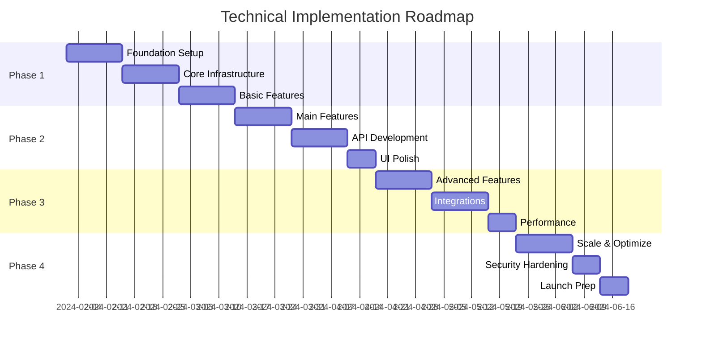

# Technical Roadmap - [Project Name]

## Overview

This roadmap outlines the phased implementation plan for [Project Name], ensuring systematic delivery of features while maintaining quality and technical excellence.

## Roadmap Principles

1. **Incremental Delivery** - Ship value early and often
2. **Risk Mitigation** - Address technical risks first
3. **User-Centric** - Prioritize user-facing features
4. **Technical Debt** - Allocate time for refactoring
5. **Flexibility** - Adapt based on feedback

## Timeline Overview

## Phase 1: Foundation (Weeks 1-3)

### Goals
Establish core infrastructure and basic functionality to enable rapid development.

### Week 1: Project Setup & Infrastructure

#### Development Environment
- [ ] Repository setup with Git workflow
- [ ] Development environment configuration
- [ ] CI/CD pipeline setup (GitHub Actions)
- [ ] Code quality tools (ESLint, Prettier, Husky)
- [ ] Testing framework setup

#### Infrastructure
- [ ] Vercel project creation
- [ ] Supabase project setup
- [ ] Domain and DNS configuration
- [ ] SSL certificates
- [ ] CDN setup (Cloudflare)

#### Database
- [ ] Initial schema design
- [ ] User and auth tables
- [ ] Core entity tables
- [ ] RLS policies
- [ ] Migration system setup

**Deliverables:**
- Working development environment
- Basic infrastructure deployed
- Database schema v1

### Week 2: Authentication & Core UI

#### Authentication System
- [ ] Supabase Auth integration
- [ ] Login/Register flows
- [ ] Password reset
- [ ] Email verification
- [ ] Session management

#### Core UI Components
- [ ] Design system implementation
- [ ] Layout components (Header, Footer, Sidebar)
- [ ] Navigation system
- [ ] Basic form components
- [ ] Loading and error states

#### Routing
- [ ] Public routes setup
- [ ] Protected routes with guards
- [ ] 404 and error pages
- [ ] SEO optimization

**Deliverables:**
- Complete auth system
- Basic UI framework
- Navigable application shell

### Week 3: Core Features MVP

#### Feature Development
- [ ] [Core Feature 1] - Basic implementation
- [ ] [Core Feature 2] - Basic implementation
- [ ] CRUD operations
- [ ] Basic search/filter
- [ ] Data validation

#### API Development
- [ ] RESTful API structure
- [ ] Basic endpoints
- [ ] Error handling
- [ ] Request validation
- [ ] Response formatting

#### Testing
- [ ] Unit tests for utilities
- [ ] Component tests
- [ ] API endpoint tests
- [ ] E2E happy path test

**Deliverables:**
- MVP with core features
- Working API
- Basic test coverage

### Phase 1 Success Criteria
- [ ] Users can register and login
- [ ] Core features are functional
- [ ] Application is deployed and accessible
- [ ] Basic tests are passing
- [ ] No critical bugs

## Phase 2: Feature Development (Weeks 4-6)

### Goals
Implement all primary features with full functionality and polish the user experience.

### Week 4: Main Feature Implementation

#### [Feature Group 1]
- [ ] Complete UI implementation
- [ ] Business logic
- [ ] API endpoints
- [ ] Real-time updates (if applicable)
- [ ] Permissions and access control

#### [Feature Group 2]
- [ ] Complete UI implementation
- [ ] Complex workflows
- [ ] Data relationships
- [ ] Bulk operations
- [ ] Export functionality

**Deliverables:**
- Fully functional main features
- Complex workflows working
- Bulk operations available

### Week 5: API & Integration

#### API Enhancement
- [ ] GraphQL endpoint (optional)
- [ ] API versioning
- [ ] Rate limiting
- [ ] API documentation (OpenAPI)
- [ ] Webhook system

#### Third-Party Integrations
- [ ] Payment processing (if applicable)
- [ ] Email service (SendGrid/Resend)
- [ ] Analytics (Google Analytics/Mixpanel)
- [ ] Error tracking (Sentry)
- [ ] File storage optimization

**Deliverables:**
- Complete API with documentation
- All integrations functional
- Monitoring in place

### Week 6: UI/UX Polish

#### Design Refinement
- [ ] Responsive design completion
- [ ] Animation and transitions
- [ ] Dark mode (if applicable)
- [ ] Accessibility audit and fixes
- [ ] Cross-browser testing

#### User Experience
- [ ] Onboarding flow
- [ ] Help documentation
- [ ] Tooltips and guides
- [ ] Keyboard shortcuts
- [ ] Mobile optimizations

**Deliverables:**
- Polished, professional UI
- Excellent mobile experience
- Accessibility compliant

### Phase 2 Success Criteria
- [ ] All planned features implemented
- [ ] UI is polished and responsive
- [ ] API is documented and stable
- [ ] Integrations are working
- [ ] User feedback incorporated

## Phase 3: Advanced Features (Weeks 7-9)

### Goals
Add advanced functionality, optimize performance, and prepare for scale.

### Week 7: Advanced Features

#### [Advanced Feature 1]
- [ ] Complex algorithm implementation
- [ ] Advanced UI components
- [ ] Performance optimization
- [ ] Caching strategy

#### [Advanced Feature 2]
- [ ] Machine learning integration (if applicable)
- [ ] Advanced analytics
- [ ] Reporting system
- [ ] Data visualization

**Deliverables:**
- Advanced features operational
- Performance baselines established

### Week 8: External Integrations

#### Integration Expansion
- [ ] Social media integrations
- [ ] Calendar integrations
- [ ] Import/Export features
- [ ] API rate limiting
- [ ] Partner API connections

#### Developer Experience
- [ ] Public API (if applicable)
- [ ] SDK development
- [ ] API playground
- [ ] Developer documentation
- [ ] Sample applications

**Deliverables:**
- All integrations complete
- Developer resources available

### Week 9: Performance & Optimization

#### Performance Optimization
- [ ] Database query optimization
- [ ] Index optimization
- [ ] Caching implementation
- [ ] CDN configuration
- [ ] Bundle size optimization

#### Load Testing
- [ ] Load testing setup
- [ ] Stress testing
- [ ] Performance benchmarks
- [ ] Optimization based on results
- [ ] Monitoring dashboards

**Deliverables:**
- Performance targets met
- Load testing complete
- Monitoring active

### Phase 3 Success Criteria
- [ ] Advanced features stable
- [ ] Performance targets achieved
- [ ] Integrations tested
- [ ] System handles expected load
- [ ] Developer resources ready

## Phase 4: Launch Preparation (Weeks 10-12)

### Goals
Ensure production readiness, security hardening, and smooth launch.

### Week 10: Scale & Reliability

#### Infrastructure Scaling
- [ ] Auto-scaling configuration
- [ ] Database replication
- [ ] Backup strategies
- [ ] Disaster recovery plan
- [ ] Multi-region setup (if needed)

#### Reliability Engineering
- [ ] Circuit breakers
- [ ] Retry mechanisms
- [ ] Graceful degradation
- [ ] Error boundaries
- [ ] Fallback strategies

**Deliverables:**
- Scalable infrastructure
- High availability achieved

### Week 11: Security & Compliance

#### Security Hardening
- [ ] Security audit
- [ ] Penetration testing
- [ ] Vulnerability scanning
- [ ] Security headers
- [ ] Input sanitization review

#### Compliance
- [ ] GDPR compliance check
- [ ] Privacy policy update
- [ ] Terms of service
- [ ] Cookie consent
- [ ] Data retention policies

**Deliverables:**
- Security audit passed
- Compliance documented

### Week 12: Launch Preparation

#### Final Testing
- [ ] Full regression testing
- [ ] User acceptance testing
- [ ] Performance verification
- [ ] Security verification
- [ ] Backup restoration test

#### Launch Checklist
- [ ] Marketing site ready
- [ ] Documentation complete
- [ ] Support system ready
- [ ] Monitoring alerts configured
- [ ] Rollback plan prepared

**Deliverables:**
- Launch-ready application
- All systems verified

### Phase 4 Success Criteria
- [ ] Production environment stable
- [ ] Security measures in place
- [ ] Compliance requirements met
- [ ] Launch plan executed
- [ ] Team trained and ready

## Post-Launch Roadmap

### Month 1 Post-Launch
- Monitor system stability
- Address user feedback
- Fix critical bugs
- Optimize based on real usage

### Month 2-3 Post-Launch
- Feature enhancements
- Performance optimization
- User-requested features
- Mobile app development (if planned)

### Long-term Vision
- International expansion
- Enterprise features
- AI/ML enhancements
- Platform ecosystem

## Risk Management

### Technical Risks

| Risk | Impact | Mitigation |
|------|--------|------------|
| Database scaling issues | High | Early load testing, read replicas |
| Third-party API failures | Medium | Circuit breakers, fallbacks |
| Security vulnerabilities | High | Regular audits, automated scanning |
| Performance degradation | Medium | Monitoring, optimization sprints |

### Schedule Risks

| Risk | Impact | Mitigation |
|------|--------|------------|
| Feature creep | High | Strict scope management |
| Technical debt | Medium | Allocated refactoring time |
| Integration delays | Medium | Early integration testing |
| Team availability | Low | Cross-training, documentation |

## Success Metrics

### Technical Metrics
- Page load time: < 3s
- API response time: < 200ms (p95)
- Uptime: > 99.9%
- Error rate: < 0.1%
- Test coverage: > 80%

### Business Metrics
- User activation rate
- Feature adoption rate
- User satisfaction (NPS)
- Support ticket volume
- Time to resolution

## Team & Resources

### Core Team
- Technical Lead: [Name]
- Frontend Developer(s): [Names]
- Backend Developer(s): [Names]
- UI/UX Designer: [Name]
- QA Engineer: [Name]

### External Resources
- Security Consultant
- Performance Expert
- DevOps Specialist

## Budget Considerations

### Infrastructure Costs (Monthly)
- Hosting: $[Amount]
- Database: $[Amount]
- CDN: $[Amount]
- Monitoring: $[Amount]
- Third-party APIs: $[Amount]
- **Total**: $[Amount]

### Development Costs
- Team salaries
- Contractor fees
- Tool licenses
- Testing services

## Communication Plan

### Weekly Updates
- Sprint progress
- Blockers and risks
- Metric updates
- Next week's goals

### Stakeholder Reviews
- Phase completion demos
- Metric dashboards
- Risk assessments
- Budget updates

## Conclusion

This roadmap provides a structured approach to building [Project Name] with clear phases, deliverables, and success criteria. The phased approach allows for early value delivery while maintaining quality and preparing for scale. Regular reviews and adaptations ensure we stay aligned with business goals while delivering technical excellence.
