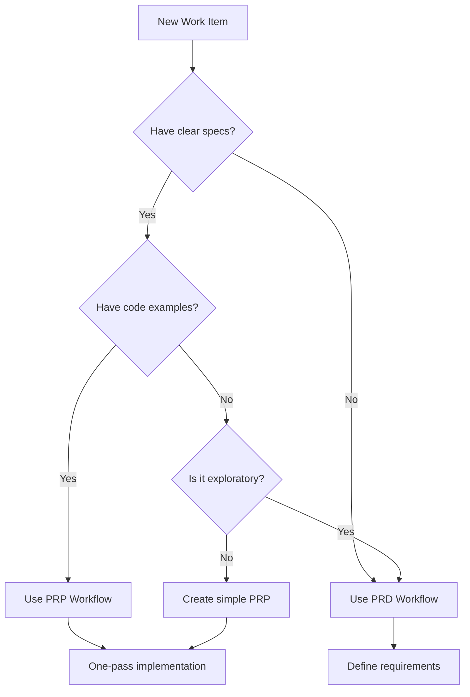

# 🚀 Master Workflow Guide - Claude Code Boilerplate v2.7.0

> **One Document to Rule Them All** - Your complete reference for maximizing the Claude Code Boilerplate system and never losing context.

## Table of Contents
1. [Quick Command Reference](#quick-command-reference)
2. [First Time Setup](#first-time-setup)
3. [Daily Workflow](#daily-workflow)
4. [Feature Development Workflows](#feature-development-workflows)
5. [Testing & Validation](#testing--validation)
6. [Context Management](#context-management)
7. [Common Scenarios](#common-scenarios)
8. [Pro Tips & Best Practices](#pro-tips--best-practices)
9. [Troubleshooting](#troubleshooting)

---

## 🎯 Quick Command Reference

> **💡 NEW: Intelligent Next Command Suggestions!**  
> After every command, the system now suggests the most logical next steps.  
> No more wondering "what should I do next?" - just follow the guided workflow!

### Essential Daily Commands
```bash
/sr                    # Smart Resume - start every session with this
/cp load frontend      # Load context profile (frontend/backend/debug)
/bt list              # Check open bugs
/checkpoint           # Manual save current state
/help                 # Context-aware help
```

### Starting Work
```bash
/fw start 123         # Start from GitHub issue #123
/create-prp feature   # Generate PRP for clear features (NEW!)
/prd feature          # Generate PRD for exploratory work
/gt feature           # Generate tasks from PRD
/pt feature           # Process tasks one by one
```

### Development Commands
```bash
/cc ComponentName     # Create component with design validation
/ctf FormName         # Create secure tracked form
/vd                   # Validate design system compliance
/deps check Button    # Check component dependencies
/exists Button        # Check if component exists (auto-runs on create)
```

### Testing Commands
```bash
/tdd-workflow feature # Start TDD workflow
/prd-tests feature    # Generate tests from PRD
/tr current           # Run tests for current file
/btf                  # Browser test flow with Playwright
```

### Validation & Quality
```bash
/prp-execute feature  # Run PRP validation loops
/sv check 2           # Check stage 2 completion
/grade                # Grade implementation against PRD
/sc                   # Security check
/validate-async       # Check async patterns
```

### Collaboration
```bash
/cti "Title"          # Capture Claude response to GitHub issue
/fw complete          # Create PR with full context
/orch feature         # Orchestrate multi-agent work
/specs extract        # Save successful patterns
```

### Advanced Features
```bash
/ut complex problem   # UltraThink - 32k+ token deep analysis
/vp feature           # Visual planning with screenshots
/research topic       # Create/update research document
/dmoff               # Disable design mode temporarily
```

---

## 🚀 First Time Setup

### 1. Clone and Initialize YOUR Project
```bash
# Clone boilerplate to YOUR project
git clone https://github.com/bearingfruitco/claude-code-boilerplate.git my-awesome-app
cd my-awesome-app

# Remove boilerplate git history
rm -rf .git
git init

# Create YOUR GitHub repo
gh repo create my-awesome-app --private --source=.

# Run quick setup
chmod +x scripts/quick-setup.sh
./scripts/quick-setup.sh

# Setup PRP system
chmod +x setup-prp.sh
./setup-prp.sh
```

### 2. Install GitHub Apps
1. **CodeRabbit**: [github.com/marketplace/coderabbit](https://github.com/marketplace/coderabbit)
   - Install on YOUR repo (not boilerplate)
   - Configure with `.coderabbit.yaml`

2. **Claude Code Bot**: [github.com/apps/claude](https://github.com/apps/claude)
   - Install on YOUR repo
   - Grant code, issues, PRs permissions

### 3. Update Configuration
```bash
# Edit .claude/project-config.json
{
  "repository": {
    "owner": "YOUR_USERNAME",
    "name": "my-awesome-app",
    "branch": "main"
  }
}
```

### 4. Start Claude Code
```bash
# Open in Claude Code
claude .

# Initialize system
/init

# Initialize YOUR project (not boilerplate!)
/init-project

# Generate GitHub issues for your project
/gi PROJECT
```

### 5. Verify Setup
```bash
# Create test PR with design violation
git checkout -b test/setup
echo '<div className="text-sm">Test</div>' > test.tsx
git add . && git commit -m "Test setup"
git push origin test/setup

# Create PR - CodeRabbit should review within 2-3 minutes
```

---

## 📅 Daily Workflow

### Morning Startup Sequence
```bash
# 1. Open project in Claude Code
claude .

# 2. Smart resume (ALWAYS start with this)
/sr

# This shows:
# - Current branch and issue
# - Modified files
# - Active TODOs
# - Open bugs
# - Active PRPs
# - Last checkpoint

# 3. Check active work
ls PRPs/active/           # Active PRPs
/bt list --open          # Open bugs
/todo                    # Current TODOs

# 4. Load appropriate context
/cp load frontend        # Or backend, debug, etc.
```

### Choosing Your Workflow



---

## 🏗️ Feature Development Workflows

### PRP Workflow (Clear Implementation Path)

Use when you know WHAT to build and have examples to follow.

#### 1. Start from Issue
```bash
/fw start 45  # "Add user avatar upload"
```

#### 2. Create PRP
```bash
/create-prp user avatar upload with crop
# or shorter: /prp avatar-upload
```

#### 3. Validate Environment
```bash
# Level 1: Check syntax, linting, design system
/prp-execute avatar-upload --level 1

# Auto-fix issues
/prp-execute avatar-upload --level 1 --fix
```

#### 4. Implement Following Blueprint
The PRP provides exact steps. Follow them phase by phase.

#### 5. Validate Each Phase
```bash
# After components created
/prp-execute avatar-upload --level 2

# After integration  
/prp-execute avatar-upload --level 3

# Before PR (full validation)
/prp-execute avatar-upload --level 4
```

#### 6. Complete
```bash
/fw complete
```

### PRD Workflow (Exploratory Development)

Use when you need to define WHAT to build.

#### 1. Start from Issue
```bash
/fw start 67  # "Customer dashboard"
```

#### 2. Create PRD
```bash
/prd customer-dashboard

# Add async requirements if needed
/prd-async customer-dashboard
```

#### 3. Generate Tasks
```bash
/gt customer-dashboard
```

#### 4. Process Tasks
```bash
# Work through tasks one by one
/pt customer-dashboard

# Check progress
/ts
/tb  # Visual task board
```

#### 5. Validate Stages
```bash
# Can't proceed without completing stages
/sv check 1  # Foundation
/sv check 2  # Core features
/sv check 3  # Polish
```

#### 6. Grade & Complete
```bash
/grade
/fw complete
```

### TDD Workflow (Test-First Development)

#### 1. Start TDD
```bash
/tdd-workflow user-profile
```

#### 2. Hook Enforcement
```
🚨 TDD ENFORCEMENT: Tests Required First!
No tests found. Follow TDD workflow:
1. Create test file first
2. Write failing tests
3. Run tests (RED phase)
4. Implement to pass (GREEN phase)
```

#### 3. Generate Tests from PRD/PRP
```bash
/prd-tests user-profile
```

#### 4. Implement with Auto-Testing
Tests run automatically after each file save!

---

## 🧪 Testing & Validation

### Automated Test Enforcement
- **Pre-hook**: Blocks component creation without tests
- **Post-hook**: Runs tests after each change
- **Stage gates**: Can't proceed without passing tests

### Testing Commands
```bash
# Start TDD for feature
/tdd-workflow feature-name

# Generate tests from requirements
/prd-tests feature-name

# Run current file's tests
/tr current

# Run all changed files' tests
/tr changed

# Browser testing
/btf login-flow

# Visual regression
/tr visual capture
/tr visual compare
```

### PRP Validation Levels
1. **🔴 Level 1**: Syntax & Standards (continuous)
   - Linting, TypeScript, design system, imports

2. **🟡 Level 2**: Component Testing
   - Unit tests, component tests, hooks

3. **🟢 Level 3**: Integration Testing
   - E2E tests, API integration, real workflows

4. **🔵 Level 4**: Production Readiness
   - Security, performance, bundle size, compliance

---

## 💾 Context Management

### Never Lose Work Again

#### Automatic Saves (Every 60 seconds)
- State saved to GitHub gists
- Includes all open files, cursor positions, context
- NOT git commits - no commit spam!

#### Manual Checkpoints
```bash
/checkpoint "Finished auth implementation"
```

#### Context Profiles
```bash
# Create focused profile
/cp create "payment-integration"

# Save current state to profile
/cp save

# Load different profile
/cp load backend

# List all profiles
/cp list
```

### Bug Tracking Across Sessions
```bash
# Add bug (persists forever)
/bt add "Login button wrong color on mobile"

# List bugs
/bt list --open

# Close bug
/bt close 3
```

### Research Documents
```bash
# Create/update research (no more doc-v1, doc-v2!)
/research payment gateways comparison

# Updates intelligently merge
/research payment gateways comparison
> "Adding Stripe API details to existing research..."
```

---

## 🎬 Common Scenarios

### Scenario: "Claude just gave me a great implementation plan"
```bash
# DON'T just say "yes do it"
# DO capture it immediately:

# Option 1: Quick capture
/cti "Implement Claude's caching strategy"

# Option 2: Full issue
gh issue create --title "Caching Strategy" \
  --body "[paste entire plan]"

# Option 3: Create PRP from it
/fw start 89
/create-prp caching strategy from claude plan
```

### Scenario: "I need to create a contact form"
```bash
# Secure form with tracking
/ctf ContactForm --vertical=debt --compliance=tcpa

# This generates:
# - PII field encryption
# - Event tracking (non-blocking)
# - TCPA compliance
# - Loading states
# - Validation
```

### Scenario: "Tests are blocking my work"
```bash
# Option 1: Follow TDD
/tdd-workflow feature

# Option 2: Generate from PRD
/prd-tests feature

# Option 3: Temporarily disable (not recommended)
# Edit .claude/hooks/config.json
{
  "tdd": {
    "enabled": false
  }
}
```

### Scenario: "I need to explore a complex problem"
```bash
# Use UltraThink for deep analysis
/ut how to implement real-time collaboration

# This runs 32k+ token analysis with:
# - Multi-perspective thinking
# - Parallel sub-agents
# - Implementation strategies
# - Trade-off analysis
```

### Scenario: "Working with async operations"
```bash
# Create form with proper async handling
/ctf LeadForm

# Add event handler
/create-event-handler form-analytics

# Validate async patterns
/validate-async

# Key principle: User actions NEVER wait for analytics!
```

---

## 💡 Pro Tips & Best Practices

### 1. Start Every Session with `/sr`
Never skip smart resume - it's your context lifeline.

### 2. Choose the Right Tool
- **PRP**: When you know what to build
- **PRD**: When exploring requirements
- **Both**: PRD for planning, PRP for implementation

### 3. Let Hooks Work for You
Don't fight the system - hooks enforce quality automatically:
- Design violations blocked before they happen
- Tests required before implementation
- PII protection automatic
- Imports fixed automatically

### 4. Use Parallel Agents
```bash
# Complex feature? Orchestrate!
/orch payment-system

# Assigns to specialists:
# - Frontend: UI components
# - Backend: API design
# - Security: Compliance
# - QA: Test planning
```

### 5. Capture Everything
```bash
# Claude gives good info? Capture it!
/cti "Performance optimization strategy"

# Found a pattern that works? Extract it!
/specs extract successful-payment-flow
```

### 6. Stage Gates Prevent Problems
```bash
# Can't skip ahead
/sv require 1  # Must complete foundation
/sv require 2  # Must complete features
/sv require 3  # Must complete polish
```

### 7. Visual Planning for UI
```bash
# Working on UI? Use visual planning
/vp dashboard-layout

# Paste screenshots, get:
# - Annotated improvements
# - Component breakdown
# - Implementation plan
```

---

## 🔧 Troubleshooting

### "Command not found"
```bash
/init  # Reinitialize system
```

### "Lost my context"
```bash
/sr  # Smart resume
/checkpoint list  # Find checkpoints
```

### "Tests won't let me work"
```bash
# Check why
/help tdd

# Generate required tests
/prd-tests feature
```

### "Design system too restrictive"
```bash
# Temporarily disable
/dmoff

# Re-enable
/dmon
```

### "PR creation failed"
```bash
# Check GitHub app permissions
# Ensure both apps installed on YOUR repo
# Check .claude/project-config.json
```

### "Hooks not running"
```bash
# Restart Claude Code
# Check hooks status
ls .claude/hooks/pre-tool-use/
```

---

## 📚 Key Files to Bookmark

- `MASTER_WORKFLOW_GUIDE.md` - This file
- `docs/claude/NEW_CHAT_CONTEXT.md` - Quick reference
- `docs/SYSTEM_OVERVIEW.md` - Complete system docs
- `PRPs/README.md` - PRP methodology
- `field-registry/README.md` - Security/compliance
- `.claude/commands/` - All command docs

---

## 🎯 The Meta Workflow

1. **Every Day**: Start with `/sr`
2. **Every Feature**: Create issue → Choose approach (PRP/PRD)
3. **Every Change**: Let hooks validate automatically
4. **Every Session**: Context auto-saves
5. **Every PR**: Full context transfers

The system is designed so you **cannot lose work** and **cannot ship broken code**. Trust the automation and focus on building great features!

---

## 🆕 Next Command Suggestion System

The system now includes intelligent next-step suggestions after every command:

### How It Works
```
You: /cti "Fix import script for 112 fields"
✅ Created issue #17

💡 Next steps:
  → `/gt import-script-fix`     # Break down into manageable tasks
  → `/fw start 17`             # Start implementation immediately
  → `/prp import-optimization` # If research needed first
```

### Smart Decision Making
- **Complexity Detection**: Suggests `/prp` for research when detecting complex problems
- **Orchestration Hints**: Shows time savings when parallel agents would help
- **Context Aware**: Different suggestions for morning vs evening
- **Stuck Detection**: Offers help when you've been idle

### Interactive Decision Guide
When unsure, use:
```bash
/help-decide  # or /hd
```

This walks you through questions to find the right command:
```
Claude: What are you trying to do?
1. 🚀 Start a new project
2. ✨ Add a new feature  
3. 🐛 Fix a bug
4. 🔍 Research/explore
5. 📝 Continue work in progress
6. 🤷 I'm not sure / I'm stuck
```

### Coverage
The suggestion system covers ALL workflows:
- **New Projects**: `/init-project` → `/gi` → `/fw start`
- **Clear Features**: `/cti` → `/gt` → `/pt` → `/test` → `/fw complete`
- **Complex Problems**: `/prp` → `/prp-execute` → `/cti` → implementation
- **Bug Fixes**: `/bt` → `/generate-tests` → fix → `/test`
- **Daily Work**: `/sr` → continue where left off

---

**Remember**: The person who communicates most effectively is the most valuable programmer. This system ensures your communication (PRDs, PRPs, issues) drives perfect implementation.
