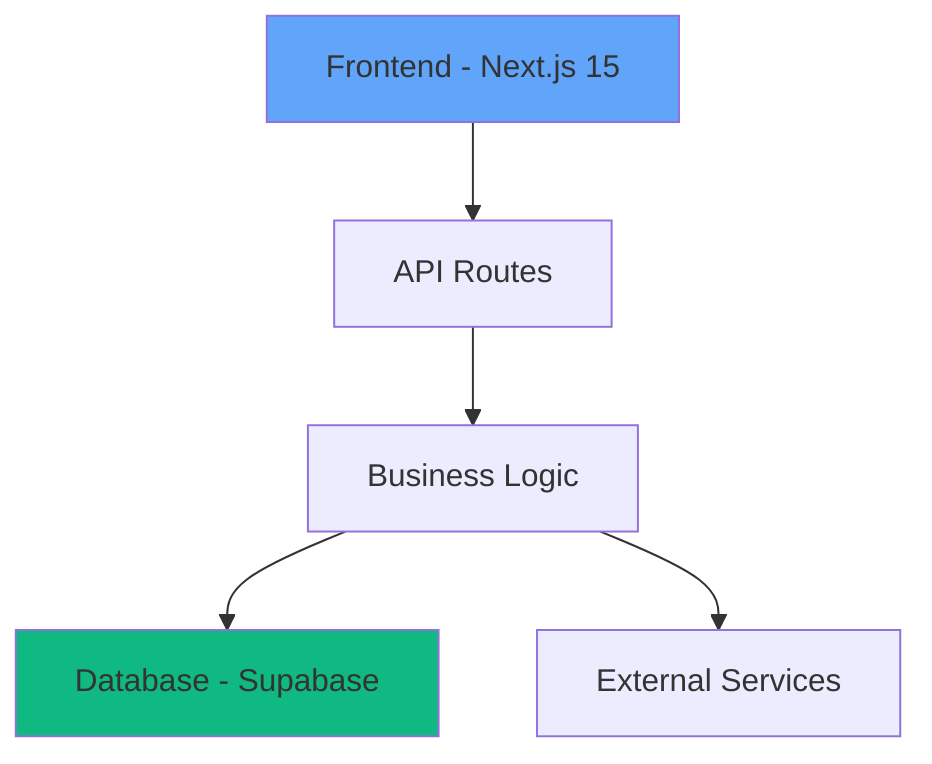
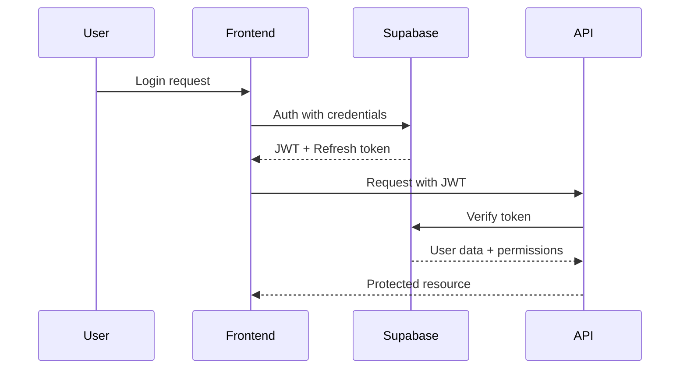

# PRP: [Project Name] - Architecture & Planning Blueprint

> **Planning-Focused PRP for System Design and Architecture Decisions**
> Use this before implementation to establish technical direction

## 🎯 Project Vision
[What are we building and why? Keep it under 3 sentences]

## 🏗️ Architecture Overview

### System Components


### Tech Stack Decisions
| Layer | Technology | Rationale |
|-------|------------|-----------|
| Frontend | Next.js 15 + React 19 | App Router, RSC, Suspense |
| Styling | Tailwind v4 + Design System | 4 sizes, 2 weights, 4px grid |
| State | Zustand + React Query | Simple state, server cache |
| Database | Supabase + Drizzle | Type-safe, real-time |
| Auth | Supabase Auth | Built-in RLS |
| Testing | Vitest + Playwright | Fast unit, reliable E2E |

## 📋 Requirements Analysis

### Functional Requirements
- [ ] **FR1**: [User can...]
- [ ] **FR2**: [System shall...]
- [ ] **FR3**: [Application must...]

### Non-Functional Requirements
- [ ] **Performance**: Page load < 2s, API response < 200ms
- [ ] **Security**: Field-level encryption for PII, audit logging
- [ ] **Accessibility**: WCAG 2.1 AA compliance
- [ ] **Mobile**: Touch targets ≥ 44px, responsive design

### Constraints
- **Budget**: Development hours, infrastructure costs
- **Timeline**: MVP by [date], full launch by [date]
- **Team**: Available expertise and capacity
- **Technical**: Browser support, device requirements

## 🔄 Data Flow Architecture

### Entity Relationships
```typescript
// Core entities
interface User {
  id: string;
  email: string; // PII - encrypted
  profile: UserProfile;
}

interface UserProfile {
  userId: string;
  name: string; // PII - encrypted
  preferences: JsonValue;
}

// Define all entities and relationships
```

### API Design
```yaml
# RESTful endpoints
GET    /api/users/:id
POST   /api/users
PUT    /api/users/:id
DELETE /api/users/:id

# Real-time subscriptions
subscribe: users:changes
subscribe: notifications:user:{id}
```

## 🛡️ Security Architecture

### Authentication Flow


### Data Protection Strategy
- **PII Fields**: Identified in field-registry
- **Encryption**: AES-256 at rest, TLS in transit
- **Access Control**: RLS policies per table
- **Audit**: Every data access logged

## 🚀 Implementation Phases

### Phase 1: Foundation (Week 1)
- [ ] Project setup with boilerplate
- [ ] Database schema and migrations
- [ ] Authentication flow
- [ ] Basic UI components

### Phase 2: Core Features (Week 2-3)
- [ ] [Feature 1] implementation
- [ ] [Feature 2] implementation
- [ ] Integration testing

### Phase 3: Polish & Launch (Week 4)
- [ ] Performance optimization
- [ ] Security audit
- [ ] Documentation
- [ ] Deployment

## 🧪 Testing Strategy

### Test Pyramid
```
         /\
        /E2E\      5% - Critical user flows
       /------\
      /  Integ  \   15% - API & DB tests
     /------------\
    /   Unit Tests  \  80% - Components & utils
   /------------------\
```

### Coverage Requirements
- Unit Tests: 80% coverage minimum
- Integration: All API endpoints
- E2E: Critical user journeys
- Performance: Lighthouse > 90

## 📊 Success Metrics

### Technical Metrics
- **Performance**: Core Web Vitals (LCP < 2.5s, FID < 100ms, CLS < 0.1)
- **Reliability**: 99.9% uptime, < 0.1% error rate
- **Security**: 0 critical vulnerabilities, passed penetration test

### Business Metrics
- **Adoption**: [Define targets]
- **Engagement**: [Define targets]
- **Retention**: [Define targets]

## ⚠️ Risk Mitigation

### Technical Risks
| Risk | Impact | Probability | Mitigation |
|------|--------|-------------|------------|
| Supabase outage | High | Low | Implement cache layer |
| Performance issues | Medium | Medium | Early load testing |
| Security breach | High | Low | Regular audits, encryption |

### Process Risks
- **Scope creep**: Locked requirements, change control
- **Timeline slip**: Weekly check-ins, adjust scope
- **Technical debt**: Refactoring sprints planned

## 🔗 Dependencies

### External Services
- **Supabase**: Database, auth, real-time
- **Vercel**: Hosting, edge functions
- **Sentry**: Error tracking
- **Analytics**: RudderStack

### Internal Dependencies
- Design system components
- Field registry definitions
- Shared utilities
- Authentication hooks

## 📚 Reference Architecture

### Similar Successful Implementations
```yaml
- project: Previous Auth System
  learnings: Use refresh token rotation
  
- project: Data Dashboard
  learnings: Virtualize large lists
  
- pattern: Form with PII
  reference: components/forms/SecureContactForm.tsx
```

## 🎯 Definition of Done

### Planning Phase Complete When:
- [ ] All stakeholders approve architecture
- [ ] Security review passed
- [ ] Performance budgets defined
- [ ] Test strategy approved
- [ ] Implementation PRPs created
- [ ] Team capacity confirmed

## 📋 Next Steps

1. **Create Implementation PRPs**:
   ```bash
   /create-prp authentication-flow
   /create-prp user-profile-management
   /create-prp data-visualization
   ```

2. **Setup Development Environment**:
   ```bash
   /init-project [name]
   /setup-database
   /configure-auth
   ```

3. **Begin Phase 1**:
   - Review this plan with team
   - Create GitHub issues
   - Start first implementation PRP

---

**Remember**: This planning PRP is a living document. Update it as decisions change and lessons are learned.
