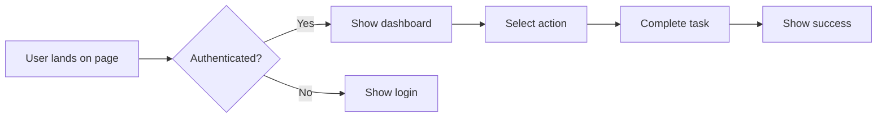
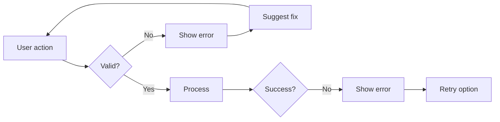

# PRP: [Feature Name] - Detailed Specification

> **Specification-Focused PRP for Complex Features**
> Use when you need comprehensive documentation before implementation

## 📋 Specification Overview

### Feature Summary
[One paragraph describing what this feature does and why it's needed]

### Business Value
- **User Benefit**: [How does this help users?]
- **Business Impact**: [Revenue, engagement, retention impact]
- **Strategic Alignment**: [How does this fit company goals?]

## 🎭 User Stories

### Primary User Story
```
As a [type of user]
I want to [perform action]
So that I can [achieve goal]
```

### Acceptance Criteria
- [ ] **AC1**: Given [context], When [action], Then [outcome]
- [ ] **AC2**: Given [context], When [action], Then [outcome]
- [ ] **AC3**: Given [context], When [action], Then [outcome]

### Edge Cases
- **Scenario 1**: What happens if [edge case]?
  - Expected: [behavior]
- **Scenario 2**: What happens if [edge case]?
  - Expected: [behavior]

## 🔄 User Flow

### Happy Path


### Error Flows


## 🎨 UI/UX Specifications

### Visual Design
```
┌─────────────────────────────────┐
│  Header (h-14)                  │
├─────────────────────────────────┤
│                                 │
│  Main Content Area              │
│  (max-w-md mx-auto p-4)        │
│                                 │
│  ┌───────────────────────────┐ │
│  │ Card Component            │ │
│  │ (border-gray-200 p-4)     │ │
│  └───────────────────────────┘ │
│                                 │
└─────────────────────────────────┘
```

### Component Specifications
- **Typography**: 
  - Headings: text-size-2 font-semibold
  - Body: text-size-3 font-regular
  - Captions: text-size-4 font-regular
  
- **Spacing**: 
  - Between sections: space-y-6
  - Within cards: space-y-3
  - Form fields: space-y-4

- **Colors**:
  - Primary action: bg-blue-600
  - Secondary: bg-gray-800
  - Errors: text-red-600
  - Success: text-green-600

### Responsive Behavior
| Breakpoint | Layout Changes |
|------------|----------------|
| Mobile (< 384px) | Single column, full width |
| Tablet (384-512px) | Increased padding |
| Desktop (> 512px) | Centered max-w-md |

## 📊 Data Requirements

### Input Data Schema
```typescript
interface FeatureInput {
  // Required fields
  id: string;
  userId: string;
  
  // Optional fields
  metadata?: {
    source: 'web' | 'mobile' | 'api';
    timestamp: Date;
  };
  
  // Feature-specific fields
  [key: string]: unknown;
}
```

### Output Data Schema
```typescript
interface FeatureOutput {
  success: boolean;
  data?: {
    id: string;
    result: ProcessedResult;
  };
  error?: {
    code: string;
    message: string;
    details?: unknown;
  };
}
```

### Validation Rules
```typescript
const validationSchema = z.object({
  // Define Zod schema matching requirements
  field1: z.string().min(2).max(50),
  field2: z.number().positive(),
  field3: z.enum(['option1', 'option2']),
});
```

## 🔐 Security Requirements

### Authentication
- **Required**: User must be authenticated
- **Roles**: ['user', 'admin', 'super_admin']
- **Permissions**: 
  - user: read own data, create, update own
  - admin: all user permissions + read all
  - super_admin: all permissions

### Data Security
- **PII Fields**: [List fields that contain PII]
- **Encryption**: Required for [list fields]
- **Audit Log**: Track all [list actions]
- **Rate Limiting**: Max 100 requests/minute/user

### Compliance
- [ ] GDPR: Right to be forgotten implemented
- [ ] CCPA: Data export available
- [ ] TCPA: Consent tracking for communications
- [ ] HIPAA: If applicable, PHI handling

## ⚡ Performance Requirements

### Response Times
- **Initial Load**: < 2 seconds
- **Interactions**: < 100ms feedback
- **API Calls**: < 500ms p95
- **Background Tasks**: Use event queue

### Scalability
- **Concurrent Users**: Support 1000+
- **Data Volume**: Handle 1M+ records
- **Growth**: 10x capacity headroom

### Optimization Strategy
- Client-side caching with React Query
- Database indexes on frequent queries
- CDN for static assets
- Code splitting by route

## 🧪 Testing Requirements

### Test Scenarios
1. **Happy Path**
   - Setup: [Initial state]
   - Action: [User steps]
   - Assert: [Expected outcome]

2. **Error Handling**
   - Setup: [Error condition]
   - Action: [User steps]
   - Assert: [Error displayed correctly]

3. **Edge Cases**
   - Setup: [Edge condition]
   - Action: [User steps]
   - Assert: [Graceful handling]

### Test Data Requirements
```typescript
// Factories for test data
const testUser = createUser({
  email: 'test@example.com',
  role: 'user',
});

const testData = createFeatureData({
  // Feature-specific test data
});
```

## 🔄 Integration Points

### API Endpoints
```typescript
// List all endpoints this feature will use
POST   /api/feature/create
GET    /api/feature/:id
PUT    /api/feature/:id
DELETE /api/feature/:id

// Webhooks
POST   /webhooks/feature/status-change
```

### External Services
- **Service 1**: Purpose, authentication method
- **Service 2**: Purpose, rate limits
- **Service 3**: Purpose, error handling

### Event Emissions
```typescript
// Events this feature will emit
eventQueue.emit('feature.created', { id, userId });
eventQueue.emit('feature.updated', { id, changes });
eventQueue.emit('feature.deleted', { id });
```

## 📈 Analytics Requirements

### Metrics to Track
- **Usage**: Feature adoption rate
- **Performance**: Load times, error rates
- **Business**: Conversion impact
- **User Behavior**: Click paths, drop-off points

### Events to Log
```typescript
analytics.track('Feature Viewed', {
  userId,
  featureId,
  source,
});

analytics.track('Feature Completed', {
  userId,
  featureId,
  duration,
  success,
});
```

## 🚀 Rollout Strategy

### Feature Flags
```typescript
const FEATURE_FLAGS = {
  ENABLE_NEW_FEATURE: false, // Start disabled
  FEATURE_PERCENTAGE: 0,     // Gradual rollout
  FEATURE_WHITELIST: [],     // Beta users
};
```

### Rollout Phases
1. **Internal Testing**: Dev team only
2. **Beta (5%)**: Selected users
3. **Gradual (25% → 50% → 100%)**: Monitor metrics
4. **Full Launch**: All users

## 📋 Implementation Checklist

### Pre-Implementation
- [ ] Spec reviewed by stakeholders
- [ ] Design approved by UX
- [ ] Security review completed
- [ ] Performance budget approved
- [ ] Test plan reviewed

### Implementation Ready
- [ ] GitHub issues created
- [ ] Implementation PRP generated
- [ ] Team assigned and briefed
- [ ] Dependencies available
- [ ] Environment prepared

---

**Next Step**: Generate implementation PRP with `/create-prp [feature-name] --from-spec`
