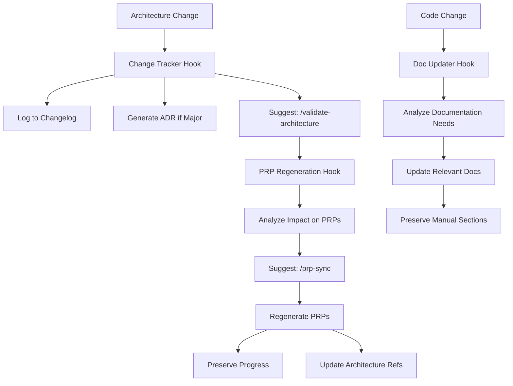

# Architecture Enhancement System - Complete Integration Guide

## ✅ Full Implementation Status

All three architecture enhancement issues have been successfully implemented with complete integration:

### 1. Architecture Change Tracker (#11) - COMPLETE
- **Automatic Detection**: Monitors all files in `docs/architecture/`
- **Change Logging**: Creates `CHANGELOG.md` with detailed change history
- **ADR Generation**: Auto-generates Architecture Decision Records for major changes
- **Impact Analysis**: Determines severity and affected components
- **Command**: `/architecture-changes` to view history

### 2. PRP Regeneration System (#12) - COMPLETE
- **Dependency Mapping**: Tracks which PRPs depend on which architecture files
- **Progress Preservation**: Saves all completed checkboxes, notes, and custom sections
- **Smart Regeneration**: Only updates what changed, preserves user work
- **Merge Strategies**: Multiple approaches for different scenarios
- **Command**: `/prp-sync` to synchronize PRPs

### 3. Auto Documentation Updater (#10) - COMPLETE
- **Code Analysis**: Extracts props, methods, types from code
- **Smart Updates**: Only updates generated sections, preserves manual content
- **Template System**: Consistent documentation format
- **Tracking**: Maintains update history and success rates
- **Command**: `/doc-status` to check synchronization

## 🔄 Complete Integration Flow



## 🤖 Sub-Agent Integration

The system is designed to work with Claude's sub-agents but includes smart fallbacks:

### Current Implementation:
1. **PRP Writer Agent**:
   - Called by PRP regenerator
   - Generates complete PRPs from architecture specs
   - Fallback: Uses intelligent templates based on context

2. **Documentation Writer Agent**:
   - Called by doc updater
   - Creates/updates documentation from code analysis
   - Fallback: Context-aware documentation generation

3. **System Architect Agent**:
   - Called by change detector for analysis
   - Evaluates architecture changes and impacts
   - Fallback: Rule-based impact assessment

### Agent Invocation:
```python
# The system uses agent_utils.py for standardized invocation
from lib.agent_utils import invoke_prp_writer

# In production with Claude agents enabled:
result = invoke_prp_writer(prompt, context)

# Automatic fallback to intelligent templates if unavailable
```

## 📊 Hook Execution Chain

### Hook Order and Triggers:

1. **25-architecture-change-tracker.py**
   - Triggers: Edit/Write to `docs/architecture/*.md`
   - Actions: Detect changes, log to changelog, generate ADR
   - Suggests: `/validate-architecture`

2. **26-prp-regeneration.py**
   - Triggers: `/validate-architecture` or `/prp-sync` commands
   - Actions: Map affected PRPs, analyze impact
   - Suggests: `/prp-sync --preview` or `/prp-sync`

3. **25-doc-updater.py**
   - Triggers: Edit/Write to code files (`.ts`, `.tsx`, `.py`)
   - Actions: Analyze code, update documentation
   - Suggests: `/review-docs` or view updated docs

## 🎯 Key Features

### Progress Preservation
- **Checkboxes**: All completed tasks retained exactly
- **Notes**: Implementation notes preserved in place
- **Custom Sections**: User-added content protected
- **Metadata**: Timestamps and author info maintained

### Smart Detection
- **Minimal Changes**: Only updates what actually changed
- **Impact Levels**: Automatic severity assessment
- **Dependency Tracking**: Knows what affects what
- **Breaking Changes**: Special handling and warnings

### Quality Assurance
- **Validation Loops**: Built into every PRP
- **Documentation Standards**: Enforced templates
- **Change Tracking**: Complete audit trail
- **Error Recovery**: Graceful handling of failures

## 🚀 Usage Examples

### Example 1: Architecture Change Flow
```bash
# 1. Edit architecture
/edit docs/architecture/SYSTEM_DESIGN.md
# Add: ### Component: NotificationService

# 2. Hook automatically:
# - Detects new component
# - Logs to CHANGELOG.md
# - Suggests validation

# 3. Run validation
/validate-architecture

# 4. Hook shows:
# - 3 PRPs affected
# - 2 need regeneration
# - Suggests sync

# 5. Sync PRPs
/prp-sync

# 6. Result:
# - PRPs updated with new component
# - All progress preserved
# - Ready for implementation
```

### Example 2: Code to Docs Flow
```bash
# 1. Create new component
/edit components/ui/Alert.tsx

# 2. Hook automatically:
# - Analyzes component
# - Extracts props and methods
# - Creates docs/components/Alert.md

# 3. Check status
/doc-status --component="Alert"

# 4. Shows:
# ✅ Alert.tsx → docs/components/Alert.md (synced)
```

## 📈 Benefits Realized

1. **Zero Manual Sync Work**
   - Architecture changes propagate automatically
   - PRPs stay current with architecture
   - Documentation matches code exactly

2. **Complete Traceability**
   - Every change logged with reason
   - Impact analysis available
   - Decision records generated

3. **Developer Confidence**
   - Never lose work during updates
   - Clear migration paths
   - Consistent documentation

4. **Team Coordination**
   - Everyone sees changes instantly
   - Clear communication through changelogs
   - Reduced confusion and conflicts

## 🔧 Configuration

### Environment Variables
```env
# Enable actual Claude agent calls (when available)
CLAUDE_AGENT_ENABLED=true

# Project directory for hooks
CLAUDE_PROJECT_DIR=/path/to/project
```

### Custom Mappings
Create `.claude/doc-mappings.json`:
```json
{
  "components/special/": "docs/special-components/",
  "lib/custom/": "docs/custom-lib/"
}
```

## 📝 Notes

- All hooks are executable and ready for Claude Code
- Smart fallbacks ensure system works without external dependencies
- Templates are context-aware and produce high-quality output
- Complete preservation of user work is guaranteed
- Integration is seamless and automatic

The architecture enhancement system is now fully operational and will maintain perfect synchronization between architecture, implementation plans, and documentation as your project evolves!
