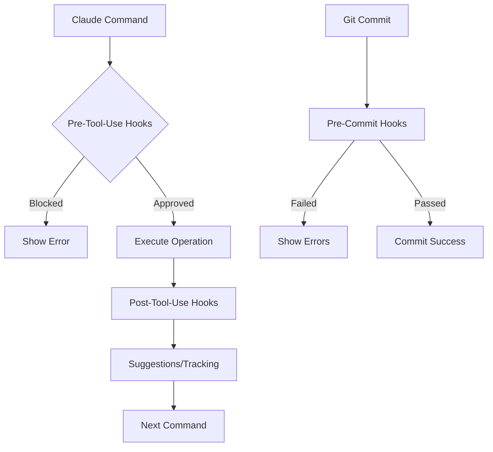

# Hook System Documentation

> Complete guide to Claude Code Boilerplate's multi-level hook system for automated enforcement and workflow enhancement.

## ? Table of Contents

1. [Overview](#overview)
2. [Hook Types](#hook-types)
3. [Pre-Tool-Use Hooks](#pre-tool-use-hooks)
4. [Post-Tool-Use Hooks](#post-tool-use-hooks)
5. [Git Pre-Commit Hooks](#git-pre-commit-hooks)
6. [Execution Order](#execution-order)
7. [Creating Custom Hooks](#creating-custom-hooks)
8. [Configuration](#configuration)
9. [Troubleshooting](#troubleshooting)
10. [Best Practices](#best-practices)

## Overview

The Claude Code Boilerplate uses a sophisticated multi-level hook system to enforce standards, automate workflows, and maintain code quality without manual intervention.

### Key Benefits

- **Automated Enforcement**: Rules are enforced by code, not documentation
- **Consistent Quality**: Every operation goes through validation
- **Smart Workflows**: Automatic suggestions and optimizations
- **Zero Manual Review**: Quality gates at multiple levels
- **Extensible**: Easy to add custom hooks

### Hook Philosophy

> "If it can be automated, it should be automated. If it should be enforced, it must be automated."

## Hook Types

### 1. MCP Hooks (Real-Time)
- **When**: As Claude writes code
- **Purpose**: Prevent violations from being written
- **Scope**: Individual file operations
- **Location**: `.claude/hooks/`

### 2. Git Hooks (Commit-Time)
- **When**: During git commit
- **Purpose**: Final validation before version control
- **Scope**: All staged files
- **Location**: `.husky/`

### 3. Command Hooks (Execution-Time)
- **When**: During command execution
- **Purpose**: Enhanced command behavior
- **Scope**: Command-specific operations
- **Location**: Built into commands

## Pre-Tool-Use Hooks

Pre-tool-use hooks run before Claude performs any file operation. They can approve, modify, or block operations.

### Directory Structure
```
.claude/hooks/pre-tool-use/
??? 00-auto-approve-safe-ops.py      # Auto-approves safe operations
??? 00a-dangerous-commands.py        # Blocks dangerous operations
??? 02-design-check.py              # Enforces design system
??? 03-conflict-check.py            # Prevents merge conflicts
??? 06-requirement-drift-detector.py # Maintains requirement fidelity
??? 07-pii-protection.py            # Protects sensitive data
??? 11-truth-enforcer.py            # Protects established values
??? 14a-creation-guard.py           # Prevents duplicate components
??? 15a-dependency-tracker.py       # Tracks component dependencies
??? 19-tdd-enforcer.py              # Enforces test-first development
```

### Core Pre-Tool-Use Hooks

#### 1. Auto-Approve Safe Operations (00-auto-approve-safe-ops.py)
```python
# Automatically approves:
- Read operations
- Directory listings
- Test file modifications
- Documentation updates
- Safe commands (lint, test, typecheck)

# Still requires approval:
- Production code changes
- Configuration modifications
- Deletions
```

#### 2. Design System Enforcement (02-design-check.py)
```python
# Enforces:
- Only 4 font sizes (text-size-[1-4])
- Only 2 font weights (font-regular, font-semibold)
- 4px spacing grid
- Minimum touch targets (44px)
- 60/30/10 color distribution

# Example violation:
"? Line 42: Forbidden font size 'text-sm'. Use text-size-3 instead"
```

#### 3. Creation Guard (14a-creation-guard.py)
```python
# Before creating any component:
1. Checks if component exists
2. Shows similar components
3. Displays usage information
4. Prevents duplicate work

# Example output:
"Component 'Button' already exists at components/ui/Button.tsx
Used in: LoginForm, Header, Card (3 locations)"
```

#### 4. Dependency Tracker (15a-dependency-tracker.py)
```python
# When modifying shared components:
1. Identifies all dependents
2. Warns about breaking changes
3. Suggests safe modification patterns
4. Updates dependency graph

# Example warning:
"?? Button is used by 5 components. Breaking changes will affect:
- LoginForm
- Header  
- Card
- Modal
- Alert"
```

### Hook Response Format

Pre-tool-use hooks can return three types of responses:

```python
# 1. Approve (silent continuation)
sys.exit(0)  # No output

# 2. Block operation
print(json.dumps({
    "decision": "block",
    "message": "Detailed reason for blocking"
}))

# 3. Modify operation (advanced)
print(json.dumps({
    "decision": "modify",
    "tool_input": modified_input
}))
```

## Post-Tool-Use Hooks

Post-tool-use hooks run after Claude completes operations. They handle tracking, learning, and suggestions.

### Directory Structure
```
.claude/hooks/post-tool-use/
??? 01-state-save.py                # Saves context to GitHub gists
??? 02-metrics.py                   # Tracks productivity metrics
??? 03-pattern-learning.py          # Extracts successful patterns
??? 04-next-command-suggester.py    # Suggests next actions
??? 05-test-runner.py              # Auto-runs affected tests
??? 10-prp-progress-tracker.py      # Tracks PRP implementation
??? 14-completion-verifier.py       # Verifies "done" claims
??? 16-agent-metrics.py            # Tracks agent performance
```

### Core Post-Tool-Use Hooks

#### 1. State Save (01-state-save.py)
```python
# Every 60 seconds:
- Saves conversation to GitHub gist
- Updates context checkpoints
- Maintains work history
- Enables perfect handoffs

# Gist format:
{
  "timestamp": "2024-01-20T10:30:00Z",
  "branch": "feature/user-auth",
  "context": "conversation_history",
  "checkpoint": "pre-refactor"
}
```

#### 2. Next Command Suggester (04-next-command-suggester.py)
```python
# Analyzes:
- Current task progress
- Recent command results
- Time of day
- Work patterns

# Suggests:
"Based on your progress:
1. /test - Run tests for changes
2. /vd - Validate design compliance
3. /commit - Stage and commit

? Consider: /chain pre-pr for comprehensive validation"
```

#### 3. Completion Verifier (14-completion-verifier.py)
```python
# When Claude says "done" or "complete":
1. Checks if tests exist
2. Verifies tests pass
3. Validates TypeScript
4. Ensures linting passes

# If issues found:
"? Hold on! Detected 'complete' but:
- No tests found for new component
- TypeScript errors in 2 files
Run /verify --full to check"
```

### Hook Event Data

Post-tool-use hooks receive rich event data:

```python
{
    "tool_name": "Write",
    "tool_input": {
        "path": "components/Button.tsx",
        "content": "..."
    },
    "tool_output": "File written successfully",
    "timestamp": "2024-01-20T10:30:00Z",
    "context": {
        "current_task": "implement-button",
        "active_prp": "ui-components"
    }
}
```

## Git Pre-Commit Hooks

Git hooks provide a final quality gate before code enters version control.

### Location: `.husky/pre-commit`

```bash
#!/bin/sh
# Claude Code Boilerplate Pre-Commit Checks

# 1. PRP Validation (if active PRP exists)
npm run prp:validate:quick

# 2. Design System Check (staged files only)
npm run design:check:staged

# 3. TypeScript Check (staged files only)
node scripts/typecheck-staged.js

# 4. Quick Tests (changed components)
npm run test:quick:staged

# 5. Debug Code Detection
# Warns about console.log in production code
```

### Key Differences from MCP Hooks

| Aspect | MCP Hooks | Git Hooks |
|--------|-----------|-----------|
| **When** | During file write | During commit |
| **Scope** | Single file | All staged files |
| **Speed** | Must be fast | Can be thorough |
| **Bypass** | Cannot bypass | Can use --no-verify |
| **Purpose** | Prevent issues | Catch issues |

## Execution Order

### Hook Priority System

Hooks are numbered 00-99 for execution order:

```
00-09: Critical system hooks (auto-approval, safety)
10-19: Core validation (design, imports, quality)
20-29: Feature hooks (dependencies, requirements)
30-39: Enhancement hooks (patterns, suggestions)
40-49: Integration hooks (external systems)
50-99: Custom user hooks
```

### Execution Flow



## Creating Custom Hooks

### Pre-Tool-Use Hook Template

```python
#!/usr/bin/env python3
"""
Custom Hook: [Description]
"""

import json
import sys
from pathlib import Path

def main():
    try:
        # Read input from Claude Code
        input_data = json.loads(sys.stdin.read())
        
        tool_name = input_data.get('tool_name', '')
        tool_input = input_data.get('tool_input', {})
        
        # Your validation logic here
        if should_block_operation(tool_name, tool_input):
            print(json.dumps({
                "decision": "block",
                "message": "Detailed reason for blocking"
            }))
            sys.exit(0)
        
        # Approve by exiting silently
        sys.exit(0)
        
    except Exception as e:
        # Log errors but don't block
        print(f"Hook error: {e}", file=sys.stderr)
        sys.exit(0)

if __name__ == '__main__':
    main()
```

### Post-Tool-Use Hook Template

```python
#!/usr/bin/env python3
"""
Custom Post-Hook: [Description]
"""

import json
import sys
from datetime import datetime

def main():
    try:
        # Read event data
        event_data = json.loads(sys.stdin.read())
        
        # Extract relevant information
        tool_name = event_data.get('tool_name', '')
        tool_output = event_data.get('tool_output', '')
        
        # Your processing logic here
        if should_take_action(tool_name, tool_output):
            # Output suggestions or actions
            print(json.dumps({
                "suggestions": [
                    "Consider running /test",
                    "Design validation recommended"
                ],
                "metrics": {
                    "files_modified": 1,
                    "timestamp": datetime.now().isoformat()
                }
            }))
        
        sys.exit(0)
        
    except Exception as e:
        print(f"Hook error: {e}", file=sys.stderr)
        sys.exit(0)

if __name__ == '__main__':
    main()
```

### Hook Best Practices

1. **Fast Execution**: Hooks must be fast (< 100ms ideal)
2. **Silent Success**: Exit with 0 and no output to approve
3. **Clear Messages**: Provide actionable error messages
4. **Error Handling**: Always wrap in try/except
5. **Logging**: Use stderr for debugging
6. **State Management**: Use .claude/cache/ for persistence

## Configuration

### Hook Configuration File

`.claude/hooks/config.json`:

```json
{
  "enabled": true,
  "hooks": {
    "pre-tool-use": {
      "timeout": 5000,
      "parallel": false,
      "stop_on_error": true
    },
    "post-tool-use": {
      "timeout": 10000,
      "parallel": true,
      "stop_on_error": false
    }
  },
  "disabled_hooks": [
    "experimental-hook.py"
  ],
  "custom_settings": {
    "design_mode": "strict",
    "auto_save_interval": 60,
    "suggestion_limit": 3
  }
}
```

### Environment Variables

```bash
# Disable all hooks temporarily
CLAUDE_HOOKS_DISABLED=1

# Verbose hook logging
CLAUDE_HOOKS_DEBUG=1

# Custom hook directory
CLAUDE_HOOKS_DIR=/path/to/custom/hooks
```

## Troubleshooting

### Common Issues

#### 1. Hook Not Running
```bash
# Check hook is executable
chmod +x .claude/hooks/pre-tool-use/my-hook.py

# Check Python shebang
head -1 .claude/hooks/pre-tool-use/my-hook.py
# Should be: #!/usr/bin/env python3
```

#### 2. Hook Blocking Everything
```bash
# Temporarily disable specific hook
mv problem-hook.py problem-hook.py.disabled

# Debug hook execution
CLAUDE_HOOKS_DEBUG=1 claude
```

#### 3. Performance Issues
```bash
# Profile hook execution time
time python3 .claude/hooks/pre-tool-use/slow-hook.py < test-input.json

# Check for blocking operations
# Hooks should not make network requests or heavy I/O
```

### Debug Mode

Enable debug mode to see hook execution:

```python
# In your hook:
import os

DEBUG = os.getenv('CLAUDE_HOOKS_DEBUG', '').lower() == '1'

if DEBUG:
    print(f"Debug: Processing {tool_name}", file=sys.stderr)
```

## Best Practices

### 1. Hook Design Principles

- **Single Responsibility**: Each hook does one thing well
- **Fast Execution**: Aim for < 100ms execution time
- **Clear Communication**: Provide actionable feedback
- **Graceful Degradation**: Errors shouldn't block work
- **Stateless**: Avoid complex state management

### 2. Testing Hooks

```bash
# Create test input
cat > test-input.json << EOF
{
  "tool_name": "Write",
  "tool_input": {
    "path": "test.tsx",
    "content": "const Button = () => <button className='text-sm'>Click</button>"
  }
}
EOF

# Test hook
python3 .claude/hooks/pre-tool-use/02-design-check.py < test-input.json
```

### 3. Hook Organization

- Use clear numbering (00-99)
- Group related hooks
- Document purpose clearly
- Include examples in comments
- Version control hook changes

### 4. Performance Optimization

```python
# Cache expensive operations
_cache = {}

def expensive_check(content):
    cache_key = hash(content)
    if cache_key in _cache:
        return _cache[cache_key]
    
    result = perform_check(content)
    _cache[cache_key] = result
    return result
```

### 5. User Experience

- Don't block unnecessarily
- Provide helpful error messages
- Suggest fixes, not just problems
- Consider workflow impact
- Allow escape hatches when needed

## Integration with Commands

Many commands integrate with the hook system:

### Design Validation
```bash
/vd              # Runs design validation hooks
/dmoff           # Temporarily disables design hooks
/dmon            # Re-enables design hooks
```

### Testing
```bash
/test            # Triggers test runner hooks
/tdd             # Activates TDD enforcement hooks
```

### State Management
```bash
/checkpoint      # Uses state save hooks
/sr              # Leverages saved hook state
```

## Advanced Topics

### Conditional Hooks

```python
# Only run for specific file types
if not file_path.endswith(('.tsx', '.jsx')):
    sys.exit(0)

# Only run in certain modes
config = load_config()
if config.get('strict_mode') != True:
    sys.exit(0)
```

### Hook Chaining

```python
# Hooks can trigger other hooks
if design_violation_found:
    # Signal to run auto-fix hook
    print(json.dumps({
        "trigger_hook": "auto-fix-design",
        "context": violation_details
    }))
```

### Async Hooks (Experimental)

```python
# For non-blocking operations
import asyncio

async def async_check():
    # Perform async operations
    await external_api_check()

# Run in thread pool to not block
from concurrent.futures import ThreadPoolExecutor
executor.submit(async_check)
```

## Summary

The hook system is the backbone of Claude Code Boilerplate's quality enforcement. By automating validation, suggestions, and tracking at multiple levels, it ensures consistent, high-quality output without manual oversight.

Key takeaways:
- Hooks enforce rules automatically
- Multiple levels catch different issues
- Extensible for custom needs
- Performance-conscious design
- User-friendly error messages

For more information, see:
- [Command Reference](./COMMAND_REFERENCE.md)
- [Design System](../design/DESIGN_SYSTEM.md)
- [Testing Guide](../testing/README.md)