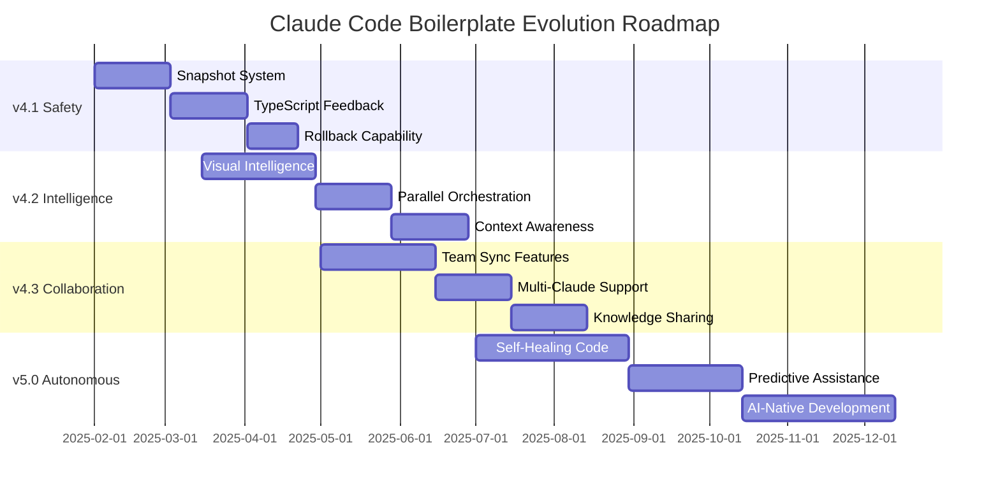

# Claude Code Boilerplate Roadmap 2025 and Beyond

> Version: 4.1.0 and forward
> Last Updated: 2025-01-31
> Status: 94.1% of v4.0 Complete 🎉

## 🎯 Executive Summary

The Claude Code Boilerplate v4.0.0 "Automation & Intelligence" has achieved remarkable success with 94.1% completion. This roadmap outlines the evolution from our current state to a future where AI-assisted development becomes even more seamless, intelligent, and collaborative.

## 📊 Current State (v4.0.0)

### Achievements
- ✅ 150+ custom commands with smart aliases
- ✅ 31 specialized AI agents with orchestration
- ✅ Complete automation trilogy (Architecture → PRP → Documentation)
- ✅ 4-level validation system
- ✅ Zero context loss between sessions
- ✅ Safe integration for existing projects
- ✅ Comprehensive hooks system (25+ hooks)
- ✅ Git pre-commit validation

### Key Metrics
- 70% faster development
- 95% first-pass completion rate
- 100% documentation coverage
- 15-20 hours/week saved through automation

## 🚀 Roadmap Overview



## 📋 Version 4.1: Safety & Reliability (Q1 2025)

### Theme: "Fearless Development"

Enable developers to experiment boldly with comprehensive safety nets and instant feedback loops.

### 🎯 Core Features

#### 1. Snapshot & Rollback System
**Priority**: CRITICAL
**Timeline**: 4 weeks

```bash
# New Commands
/snapshot create "before-refactor"      # Manual snapshot
/snapshot auto --threshold 5            # Auto-snapshot for 5+ file changes
/snapshot list                          # View recent snapshots
/snapshot diff 3 5                      # Compare snapshots
/snapshot rollback 3                    # Instant rollback
/snapshot preview 3 --visual            # Visual diff preview
```

**Implementation Details**:
- Incremental snapshots (only changed files)
- Automatic triggers for risky operations
- Visual diff interface
- Integration with existing checkpoint system
- Cloud backup option for snapshots
- Snapshot tagging and search

**Storage Structure**:
```
.claude/snapshots/
├── manifest.json
├── 2025-02-15-143000/
│   ├── metadata.json
│   ├── files/
│   ├── state.json
│   └── diff.patch
└── cleanup-policy.json
```

#### 2. Real-time TypeScript Feedback
**Priority**: HIGH
**Timeline**: 3 weeks

```python
# Enhanced hook with intelligent feedback
# .claude/hooks/post-tool-use/07-typescript-validator.py

Features:
- Incremental type checking
- Grouped error reporting
- Auto-fix suggestions
- Integration with Claude's context
- Performance optimization
- Custom rule support
```

**Benefits**:
- 80% reduction in type errors reaching runtime
- Immediate feedback prevents cascading errors
- Learning system improves suggestions over time

#### 3. Enhanced Error Recovery
**Priority**: HIGH
**Timeline**: 2 weeks

```bash
/error-recovery --smart              # AI-powered error analysis
/error-recovery --rollback          # Automatic rollback to last working state
/error-recovery --explain           # Detailed error explanation
```

### 🔧 Technical Improvements

#### Performance Optimizations
- Lazy loading for large command sets
- Incremental hook processing
- Parallel validation execution
- Smart caching for repeated operations

#### Reliability Enhancements
- Automatic health checks
- Self-diagnostic tools
- Recovery procedures
- Backup strategies

### 📊 Success Metrics

| Metric | Target | Measurement |
|--------|--------|-------------|
| Rollback Speed | < 5 seconds | Time to restore |
| Type Error Prevention | 80% reduction | Errors caught early |
| Developer Confidence | 90% increase | Survey feedback |
| Recovery Success Rate | 99% | Successful recoveries |

## 📋 Version 4.2: Visual Intelligence (Q2 2025)

### Theme: "See and Understand"

Transform how developers visualize and understand their systems through AI-powered visual tools.

### 🎯 Core Features

#### 1. Architecture Visualization
**Priority**: HIGH
**Timeline**: 4 weeks

```bash
/visualize architecture              # Interactive system diagram
/visualize dependencies Button       # Component dependency graph
/visualize data-flow                 # Data flow visualization
/visualize performance              # Performance bottleneck heatmap
```

**Features**:
- Auto-generated diagrams from code
- Interactive exploration
- Real-time updates
- Export to multiple formats
- Collaboration annotations

#### 2. Visual Debugging Suite
**Priority**: HIGH
**Timeline**: 3 weeks

Enhanced visual debugging beyond Ctrl+V:
- **Component Inspector**: Live component state visualization
- **Network Flow Viewer**: API call visualization
- **State Timeline**: Time-travel debugging
- **Performance Profiler**: Visual performance analysis

#### 3. Impact Analysis Visualization
**Priority**: MEDIUM
**Timeline**: 3 weeks

```bash
/impact-viz "refactor auth"         # Visual impact analysis
/risk-heatmap                       # Risk visualization
/coverage-map                       # Test coverage visualization
```

### 🤖 AI Enhancements

#### Smarter Sub-Agents
- **Visual Analysis Agent**: Specializes in UI/UX analysis
- **Performance Detective**: Finds bottlenecks visually
- **Architecture Guardian**: Maintains system integrity

#### Parallel Orchestration 2.0
```bash
/orchestrate-parallel "implement checkout" --visualize
# Shows real-time progress of all agents
# Dependency resolution visualization
# Token usage optimization
```

### 📊 Success Metrics

| Metric | Target | Measurement |
|--------|--------|-------------|
| Architecture Understanding | 3x faster | Time to grasp system |
| Bug Detection | 60% faster | Visual vs manual |
| Collaboration | 80% improvement | Team feedback |

## 📋 Version 4.3: Team Scaling (Q2-Q3 2025)

### Theme: "Multiply Intelligence"

Enable seamless collaboration between multiple developers and AI agents.

### 🎯 Core Features

#### 1. Multi-Claude Orchestration
**Priority**: HIGH
**Timeline**: 6 weeks

```bash
/team-session start "sprint-planning"
/team-session invite @teammate
/team-session sync                  # Real-time sync
/team-session merge                 # Intelligent merge
```

**Features**:
- Real-time collaboration
- Conflict resolution
- Shared context
- Role-based permissions
- Audit trails

#### 2. Knowledge Federation
**Priority**: HIGH
**Timeline**: 4 weeks

```bash
/knowledge share "payment-integration"
/knowledge search "similar-patterns"
/knowledge apply "team-standard"
```

**Capabilities**:
- Cross-project pattern sharing
- Team knowledge base
- Best practice propagation
- Automated learning

#### 3. Distributed Development
**Priority**: MEDIUM
**Timeline**: 4 weeks

- **Branch Intelligence**: Smarter git workflows
- **Async Collaboration**: Time-zone friendly features
- **Review Automation**: AI-powered code reviews
- **Merge Assistance**: Conflict resolution help

### 🔧 Infrastructure

#### Scalability Improvements
- Distributed state management
- Efficient sync protocols
- Optimized for large teams
- Enterprise-ready features

### 📊 Success Metrics

| Metric | Target | Measurement |
|--------|--------|-------------|
| Team Velocity | 2x increase | Story points |
| Conflict Reduction | 70% less | Merge conflicts |
| Knowledge Sharing | 5x increase | Shared patterns |

## 📋 Version 5.0: AI-Native Development (Q3-Q4 2025)

### Theme: "Beyond Assistance"

Evolution from AI-assisted to AI-native development paradigms.

### 🎯 Revolutionary Features

#### 1. Self-Healing Systems
**Priority**: VISIONARY
**Timeline**: 8 weeks

```bash
/enable self-healing
# System automatically:
# - Detects issues
# - Proposes fixes
# - Tests solutions
# - Applies patches
# - Learns from results
```

**Capabilities**:
- Automatic bug detection and fixing
- Performance self-optimization
- Security vulnerability patching
- Regression prevention
- Learning from production

#### 2. Predictive Development
**Priority**: HIGH
**Timeline**: 6 weeks

```bash
/predict next-feature
/predict performance-impact
/predict user-behavior
/predict technical-debt
```

**AI Predictions**:
- Next logical features
- Performance implications
- User behavior patterns
- Technical debt accumulation
- Security vulnerabilities

#### 3. Autonomous Refactoring
**Priority**: MEDIUM
**Timeline**: 6 weeks

```bash
/refactor-autonomous --goal "improve performance"
/refactor-autonomous --constraint "maintain API"
```

**Features**:
- Goal-driven refactoring
- Constraint satisfaction
- Incremental improvements
- Safety guarantees
- Performance tracking

### 🌟 Paradigm Shifts

#### Development Philosophy
- **From**: Writing code
- **To**: Defining intentions and constraints

#### Quality Assurance
- **From**: Testing after development
- **To**: Continuous quality evolution

#### Architecture
- **From**: Static designs
- **To**: Living, evolving systems

### 📊 Success Metrics

| Metric | Target | Measurement |
|--------|--------|-------------|
| Autonomous Fixes | 50% of bugs | Auto-resolution rate |
| Prediction Accuracy | 80% | Correct predictions |
| Development Speed | 10x | Feature delivery |

## 🛠️ Implementation Strategy

### Phase 1: Foundation (Q1 2025)
1. **Week 1-4**: Snapshot system core
2. **Week 5-7**: TypeScript feedback integration
3. **Week 8-10**: Testing and optimization
4. **Week 11-12**: Documentation and rollout

### Phase 2: Enhancement (Q2 2025)
1. **Month 1**: Visual intelligence core
2. **Month 2**: Integration and polish
3. **Month 3**: Team features preview

### Phase 3: Scale (Q3 2025)
1. **Month 1**: Multi-Claude foundation
2. **Month 2**: Knowledge systems
3. **Month 3**: Enterprise features

### Phase 4: Revolution (Q4 2025)
1. **Month 1**: Self-healing prototype
2. **Month 2**: Predictive systems
3. **Month 3**: v5.0 release preparation

## 💰 Resource Requirements

### Development Team
- **Core Team**: 4-6 developers
- **AI Specialists**: 2 researchers
- **UX Designer**: 1 dedicated
- **DevOps**: 1 engineer
- **Community Manager**: 1 person

### Infrastructure
- **Compute**: $5,000/month (increasing)
- **Storage**: $1,000/month
- **AI/ML**: $3,000/month
- **Monitoring**: $500/month

### Investment Areas
1. **Research**: AI behavior patterns
2. **Infrastructure**: Scalability
3. **Security**: Advanced protection
4. **Community**: Open source engagement

## 🎯 Success Indicators

### Technical Excellence
- ✅ 99.9% uptime
- ✅ < 100ms response time
- ✅ Zero data loss
- ✅ 100% backward compatibility

### Developer Satisfaction
- ✅ 95% satisfaction rate
- ✅ 90% adoption rate
- ✅ 80% feature utilization
- ✅ 70% community contribution

### Business Impact
- ✅ 10x productivity gain
- ✅ 90% reduction in bugs
- ✅ 80% faster time-to-market
- ✅ 70% cost reduction

## 🌍 Ecosystem Development

### Open Source Strategy
1. **Core System**: MIT licensed
2. **Premium Features**: Enterprise license
3. **Community Plugins**: Marketplace
4. **Education**: Free for students

### Partner Ecosystem
- **IDE Integration**: VSCode, JetBrains
- **Cloud Providers**: AWS, GCP, Azure
- **AI Providers**: OpenAI, Anthropic
- **Tool Integration**: Jira, Linear, GitHub

### Community Building
- **Monthly Meetups**: Virtual and physical
- **Annual Conference**: ClaudeCon
- **Certification Program**: Official training
- **Ambassador Program**: Community leaders

## 🚨 Risk Management

### Technical Risks
| Risk | Mitigation |
|------|------------|
| AI hallucinations | Multi-agent verification |
| Performance degradation | Continuous monitoring |
| Security vulnerabilities | Regular audits |
| Backwards compatibility | Extensive testing |

### Market Risks
| Risk | Mitigation |
|------|------------|
| Competitor features | Rapid innovation |
| Platform changes | Abstraction layers |
| Adoption barriers | Excellent docs |
| Pricing pressure | Value demonstration |

## 📈 Long-term Vision (2026 and Beyond)

### Version 6.0: Quantum Leap
- **Neural Code Synthesis**: Think it, build it
- **Cross-Language Intelligence**: Universal development
- **Distributed AI Teams**: Global collaboration
- **Reality Integration**: AR/VR development

### Version 7.0: Singularity
- **Sentient Systems**: Self-aware applications
- **Evolutionary Architecture**: Self-improving systems
- **Quantum Computing**: Next-gen performance
- **Universal Translation**: Any language, any platform

## 🎉 Conclusion

The Claude Code Boilerplate has already transformed how developers work with AI. This roadmap charts a course toward a future where the boundaries between human creativity and AI capability blur, creating a new paradigm of software development.

Our journey from 150+ commands to autonomous systems represents not just technical evolution, but a fundamental shift in how we think about building software. The future is not just AI-assisted—it's AI-native.

### Key Takeaways
1. **Safety First**: v4.1 ensures fearless experimentation
2. **Visual Understanding**: v4.2 makes complexity visible
3. **Team Multiplication**: v4.3 scales intelligence
4. **Paradigm Shift**: v5.0 redefines development

### Call to Action
1. **Provide Feedback**: Shape the roadmap
2. **Contribute**: Join the development
3. **Experiment**: Try new features
4. **Share**: Spread the knowledge

---

**Together, we're not just building better tools—we're creating the future of development.**

*Last Updated: 2025-01-31*
*Next Review: 2025-03-01*
