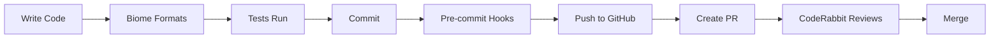

# 🚀 Day 1 Complete Setup Guide - Zero to Production-Ready

## What This Guide Gives You
By the end of this guide, you'll have:
- ✅ Complete project setup with Claude Code
- ✅ PRD-driven development workflow
- ✅ Task-based feature building
- ✅ Auto-updating documentation
- ✅ Browser testing with Playwright
- ✅ **Bun + Biome + pnpm** development environment
- ✅ **GitHub integration with auto-saves**
- ✅ **Regular commits every 3 tasks**
- ✅ **Context that never gets lost**
- ✅ **Safety features that prevent common AI mistakes**

## 🐙 How GitHub Integration Works

**Automatic Features:**
- **Gist saves**: Every 60 seconds your work state saves to GitHub gists
- **Manual commits**: You control when to commit (use `/cr` command)
- **Issue tracking**: All work linked to GitHub issues
- **Smart resume**: Restores context from multiple GitHub sources
- **Safety hooks**: Prevent accidental changes, deletions, and errors

## Prerequisites
```bash
# Verify you have these installed:
claude-code --version  # Need @anthropic-ai/claude-code
git --version
gh --version
node --version  # Need v22+
bun --version   # Need v1.0+
pnpm --version  # Need v9+
python3 --version

# If missing any:
# Claude Code: npm install -g @anthropic-ai/claude-code (included with Claude Pro/Max)
# Git: brew install git
# GitHub CLI: brew install gh
# Node: brew install node@22
# Bun: curl -fsSL https://bun.sh/install | bash
# pnpm: npm install -g pnpm@9
# Python: brew install python@3
```

## Step 0: Install Claude Code (REQUIRED)

⚠️ **Claude Code is required for all automation features in this boilerplate**

```bash
# Install Claude Code (included with Claude Pro/Max subscriptions)
npm install -g @anthropic-ai/claude-code

# Verify installation
claude-code --version

# If command not found, reload your shell:
source ~/.zshrc  # or restart terminal
```

## Step 0.5: Configure GitHub Access (CRITICAL)

**This enables all automatic features:**

```bash
# Authenticate GitHub CLI
gh auth login
# Choose: GitHub.com → HTTPS → Yes → Browser

# Verify authentication
gh auth status
# Should show: ✓ Logged in to github.com

# Test GitHub access
gh issue list --repo cli/cli --limit 3

# Configure git identity
git config --global user.name "Your Name"
git config --global user.email "your.email@example.com"
```

## Step 1: Project Creation (5 minutes)

### Option A: Clone from GitHub (RECOMMENDED)

```bash
# 1. Clone the boilerplate with your project name
git clone https://github.com/bearingfruitco/claude-code-boilerplate.git my-awesome-project
cd my-awesome-project

# 2. Remove boilerplate history and create your own
rm -rf .git
git init
git add .
git commit -m "Initial commit from Claude Code boilerplate"

# 3. Create YOUR GitHub repo and push
gh repo create my-awesome-project --private --source=. --remote=origin --push
```

### Option B: Copy from Local (If you have it)

```bash
# Create and setup project
mkdir my-awesome-project && cd my-awesome-project

# Copy boilerplate
cp -r /path/to/claude-code-boilerplate/* .
cp -r /path/to/claude-code-boilerplate/.claude .

# Initialize git
git init && git add . && git commit -m "Initial boilerplate"

# Create GitHub repo
gh repo create my-awesome-project --private --source=. --remote=origin --push
```

## Step 2: Initial Setup with Bun + pnpm (2 minutes)

```bash
# Install dependencies with pnpm
pnpm install

# Verify Bun is working
bun --version

# Verify Biome is installed
pnpm biome --version

# Make scripts executable
chmod +x scripts/*.sh

# Run setup script
./scripts/setup-enhanced-boilerplate.sh

# Create .env.local (add your keys later)
cp .env.example .env.local
```

## Step 3: Configure Development Tools

### Biome Configuration
The project uses Biome for linting and formatting. Configuration is in `biome.json`:

```bash
# Check code with Biome
pnpm lint

# Fix and format code
pnpm lint:fix
pnpm format
```

### Bun Configuration
Bun is configured in `bunfig.toml` for:
- Test runner with coverage
- Auto-install missing packages
- pnpm-style hoisting

```bash
# Run tests with Bun
bun test

# Run tests with coverage
bun test --coverage

# Run dev server with Bun
bun dev
```

## Step 4: Start Claude Code (30 seconds)

```bash
# Start Claude Code in your project
claude-code .

# The AI will greet you. Your first commands:
/init              # One-time initialization (creates .claude/ configs)
```

## Step 5: Define Your Project (10 minutes)

Run the project initialization interview:

```bash
/init-project      # or /ip
```

This interactive process will:
1. Ask about your project type
2. Define your tech stack preferences
3. Create PROJECT_PRD.md with your vision
4. Set up BUSINESS_RULES.md
5. Configure project settings

## Step 6: Generate GitHub Issues (2 minutes)

**What This Does**: Converts your PROJECT_PRD into trackable GitHub issues. Each major feature becomes an issue that you'll work on.

```bash
# Convert your PROJECT_PRD into GitHub issues
# Replace PROJECT with your actual project name from Step 5
/generate-issues PROJECT    # or /gi PROJECT

# Example: If your project is named "my-saas-app":
/generate-issues my-saas-app    # or /gi my-saas-app
```

**What Happens**:
- Reads your PROJECT_PRD.md file
- Identifies major features (authentication, dashboard, etc.)
- Creates a GitHub issue for each feature
- Numbers them sequentially (#1, #2, #3, etc.)

This creates issues like:
- Issue #1: User Authentication
- Issue #2: Task Management  
- Issue #3: Team Dashboard
- Issue #4: Real-time Chat

**Why This Matters**: GitHub issues become your project's backbone. Everything links to them - branches, PRs, and progress tracking.

## Step 7: Start Your First Feature (20 minutes)

**Overview**: This step takes you through the complete feature development workflow. You'll work on one GitHub issue from start to finish.

### 7.1 Start Feature Workflow
```bash
# Start working on first issue (e.g., Issue #1: User Authentication)
/fw start 1                # Creates branch: feature/1-user-authentication
```

**What This Does**:
- Creates a new git branch named after the issue
- Sets up an isolated workspace for this feature
- Links everything to GitHub issue #1
- Loads any previous context if you've worked on this before

### 7.2 Create Feature PRD (Product Requirements Document)
```bash
# Generate detailed PRD for this specific feature
/prd user-authentication
```

**What This Does**:
- Creates a detailed specification for JUST this feature
- Saves to: `docs/project/features/user-authentication-PRD.md`
- Includes:
  - User stories ("As a user, I want to...")
  - Acceptance criteria (checklist for "done")
  - Technical requirements
  - UI/UX specifications
  - Edge cases and error handling

**Why Name It**: The name (user-authentication) becomes the identifier for all related files.

### 7.3 Generate Implementation Tasks
```bash
# Break PRD into small, manageable tasks
/gt user-authentication     # Creates ~15-20 tasks
```

**What This Does**:
- Reads the PRD you just created
- Breaks it into bite-sized tasks (5-15 minutes each)
- Saves to: `docs/project/features/user-authentication-tasks.md`
- Numbers tasks hierarchically (1.1, 1.2, 2.1, etc.)

**Example Tasks Generated**:
```
1.1 Create user database schema
1.2 Set up authentication middleware  
1.3 Design login form component
1.4 Implement form validation
1.5 Create signup API endpoint
... (continues for ~20 tasks)
```

### 7.4 Process Tasks One by One
```bash
# Work through tasks systematically
/pt user-authentication
```

**What This Does**:
1. Shows you task 1.1
2. Claude implements it
3. **Automatically runs tests** to verify it works
4. Asks for your approval
5. Moves to task 1.2
6. **Auto-saves** progress every 60 seconds
7. **Commits** every 3 tasks

**Behind the Scenes**:
- 🔧 **Linting**: Biome auto-formats code as it's written
- 🎨 **Design validation**: Checks Tailwind classes are correct
- 💾 **GitHub Gist**: Saves your progress (work-state-issue-1.json)
- ✅ **Testing**: Runs relevant tests before moving on

**Your Role**: Review and approve each task. You can:
- ✅ Approve and continue
- 🔄 Request changes
- ⏭️ Skip a task
- 🛑 Stop and resume later

## Step 8: Understanding Safety Features (NEW)

### What's Protected Automatically

The system now includes safety hooks that run silently:

1. **Truth Enforcement** - Prevents changing established values
   ```bash
   /facts              # See what's protected
   /exists Button      # Check before creating
   ```

2. **Deletion Guard** - Warns before removing code
3. **Hydration Protection** - Catches Next.js SSR errors
4. **Import Validation** - Fixes path issues

### When You Need to Override
```bash
# If you need to refactor API routes or other protected values:
/truth-override "API v2 migration"
# Or include "refactor" in your task name
```

## Step 9: Verify Everything Works

### Check GitHub Integration
```bash
# In terminal (not Claude Code)
gh gist list --limit 3     # Should show your saved states
git log --oneline -5       # Should show commits
gh issue list              # Should show your issues
```

### Check Development Environment
```bash
# Verify Bun
bun test                   # Should run tests
bun dev                    # Should start dev server

# Verify Biome
pnpm lint                  # Should check code
pnpm format                # Should format code

# Verify build
bun run build              # Should build successfully
```

### Check Claude Commands
```bash
# In Claude Code
/help                      # See all commands
/sr                        # Smart resume (shows saved state)
/ts                        # Task status
/sas                       # Sub-agent status
```

## Step 10: Daily Workflow Setup

### Morning Routine
```bash
/sr                        # Resume where you left off (shows safety status)
/facts                     # See protected values
/ws                        # Check work status
/todo list                 # See any TODOs
```

### During Development
```bash
# Before creating anything
/exists ComponentName      # Check if it already exists
/pc ComponentName         # Pre-component check chain

# Safe development
/cc ui ComponentName       # Create components (validated)
/vd                        # Validate continuously
/chain safe-commit        # Before committing
/checkpoint create         # Manual saves
/btf feature-name         # Browser test

# Run tests with Bun
bun test                   # Unit tests
bun test:e2e              # E2E tests
```

### Code Quality
```bash
# Biome checks (automatic with hooks)
pnpm lint                  # Check issues
pnpm lint:fix             # Auto-fix
pnpm format               # Format code

# Type checking
pnpm typecheck            # TypeScript validation
```

### End of Day
```bash
/fw complete 1            # When feature is done
/checkpoint create "EOD"  # Final save
```

## Step 11: Quality Assurance & Additional Tools

### Built-in Quality Checks (Automatic)

**What Runs Automatically**:

| Tool | When It Runs | What It Checks |
|------|--------------|----------------|
| **Biome** | Every file save | Formatting, basic linting |
| **TypeScript** | Pre-commit | Type safety, compile errors |
| **Design Validation** | During `/vd` command | Tailwind classes, spacing |
| **Git Hooks** | Before every commit | Linting + TypeScript |
| **Test Runner** | During `/pt` tasks | Unit tests for new code |

### Optional Enhanced Tools

#### CodeRabbit (Recommended for Production)

**What It Is**: AI-powered code reviewer that runs on every PR.

**Setup** (one-time, 2 minutes):
```bash
# 1. Visit: https://github.com/apps/coderabbitai
# 2. Click "Install" 
# 3. Select your repository
# 4. That's it! Runs automatically on PRs
```

**What It Catches That Built-in Tools Miss**:
- 🔒 Security vulnerabilities (exposed API keys, SQL injection)
- 🧠 Logic errors (off-by-one, null pointer exceptions)
- ⚡ Performance issues (N+1 queries, memory leaks)
- 📚 Best practices (SOLID principles, DRY violations)
- 📊 Complexity (suggests simpler approaches)

**When to Add It**:
- ✅ **Yes**: Client projects, team projects, production apps
- ❌ **Skip**: Learning projects, prototypes, personal experiments

#### Other Optional Tools

**1. Sentry (Error Tracking)**
- Already configured in boilerplate
- Add your DSN to `.env.local`
- Catches production errors

**2. Vercel Analytics**
- Pre-installed in package.json
- Activate in Vercel dashboard
- Tracks Core Web Vitals

**3. Bundle Analyzer**
```bash
pnpm analyze  # Check bundle size
```

### Your Development Flow with Quality Checks



**Key Points**:
1. 🤖 Most quality checks are **automatic** - you don't need to think about them
2. 🔍 Focus on `/vd` during development for immediate feedback
3. 🚀 Add CodeRabbit when project becomes "real" (has users/clients)
4. 📊 Use bundle analyzer before major releases

## Common Issues & Solutions

### "Command not found: bun"
```bash
# Install Bun
curl -fsSL https://bun.sh/install | bash
source ~/.bashrc  # or ~/.zshrc
```

### "Biome errors"
```bash
# Auto-fix most issues
pnpm lint:fix

# Format code
pnpm format
```

### "pnpm not found"
```bash
npm install -g pnpm@9
```

## Success Checklist

- [ ] Claude Code installed and working
- [ ] GitHub CLI authenticated
- [ ] Bun installed and verified
- [ ] pnpm installed and dependencies installed
- [ ] Biome working for linting/formatting
- [ ] Project cloned/created
- [ ] `/init` completed
- [ ] `/init-project` defined your project
- [ ] GitHub issues created
- [ ] First feature started
- [ ] Auto-save verified (check gists)
- [ ] Tests running with Bun
- [ ] Safety features active (run `/sr` to confirm)

## Scripts Available

```bash
# Development
bun dev                    # Start dev server
bun build                  # Build for production
bun start                  # Start production server

# Testing
bun test                   # Run all tests
bun test:watch            # Watch mode
bun test:coverage         # With coverage
bun test:e2e              # Playwright E2E tests

# Code Quality
pnpm lint                  # Biome check
pnpm lint:fix             # Biome fix
pnpm format               # Format code
pnpm typecheck            # TypeScript check

# Database
pnpm db:push              # Push schema to DB
pnpm db:studio            # Open Drizzle studio
pnpm db:migrate           # Run migrations

# Utilities
pnpm check:all            # Run all checks
pnpm analyze              # Bundle analysis
```

## Tech Stack Summary

- **Runtime**: Bun v1.0+
- **Framework**: Next.js 15 with App Router
- **Language**: TypeScript (strict mode)
- **Package Manager**: pnpm v9
- **Linting/Formatting**: Biome
- **Styling**: Tailwind CSS v4
- **Database**: Supabase + Drizzle ORM
- **State**: Zustand + React Query (TanStack)
- **Testing**: Bun test + Playwright
- **Forms**: React Hook Form + Zod
- **Icons**: Lucide React

## 🎉 Congratulations!

You now have:
- ✅ A working project with Bun + Biome + pnpm
- ✅ Claude automation with GitHub integration
- ✅ PRD-driven development workflow
- ✅ Design system enforcement
- ✅ Multi-agent capabilities
- ✅ Modern tooling (Bun for speed, Biome for consistency)

**Pro tip**: Keep `QUICK_REFERENCE.md` open in another tab for easy command access.

### 🆕 New Safety Features

Your project now includes automatic protection against common AI mistakes:
- **No more accidental API route changes**
- **No more recreating existing components**
- **No more hydration errors in production**
- **No more inconsistent import paths**

See `/help new` for all the latest features!

---

Welcome to the future of AI-assisted development with modern tooling! 🚀
