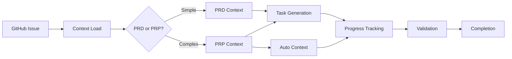

# Unified PRP Workflow Guide

## 🎯 Overview

This guide shows how all commands, hooks, and automation work together seamlessly for both simple and complex features.

## 🔄 Complete Workflows

### Workflow 1: Simple Feature (PRD Path)

```bash
# 1. Start from GitHub issue
/fw start 42

# 2. Create simple PRD
/prd add user profile page

# 3. Generate and process tasks
/gt add-user-profile
/pt add-user-profile

# 4. Validate and complete
/vd                    # Design check
/test                  # Run tests
/grade                 # Check quality
/fw complete 42        # Create PR
```

### Workflow 2: Complex Feature (PRP Path)

```bash
# 1. Start from GitHub issue
/fw start 43

# 2. Create comprehensive PRP
/create-prp payment integration with stripe

# 3. Validate PRP readiness
/prp-validate payment-integration

# 4. Generate tasks from PRP blueprint
/gt payment-integration --from-prp

# 5. Process with automatic validation
/pt payment-integration
# (Validation runs automatically at checkpoints)

# 6. Monitor progress
/prp-status payment-integration

# 7. Complete when all validation passes
/prp-execute payment-integration --all-levels
/grade --prp payment-integration
/prp-complete payment-integration
/fw complete 43
```

### Workflow 3: Convert Existing PRD

```bash
# 1. Have existing PRD
/prd authentication system

# 2. Realize need automation/more detail
/prd-to-prp authentication-system

# 3. Continue with PRP workflow
/prp-validate authentication-system
/gt authentication-system --from-prp
/pt authentication-system
```

### Workflow 4: Automated CI/CD

```bash
# 1. Create PRP with high confidence
/create-prp data-pipeline
/prp-validate data-pipeline

# 2. Run automated implementation
python scripts/prp_runner.py --prp data-pipeline --output-format json

# 3. Check results
/prp-status data-pipeline
cat PRPs/execution_logs/data-pipeline_*.json
```

## 🔗 How Everything Connects

### 1. Context Flow



### 2. Hook Coordination

```yaml
Pre-Tool-Use Flow:
1. Auto-Approve → Checks if safe operation
2. PRP Context Loader → Loads PRP context when relevant
3. Design Check → Validates CSS/structure
4. Requirement Drift → Ensures compliance
5. Creation Guard → Prevents duplicates
6. PRP Validator → Checks PRP-specific rules

Post-Tool-Use Flow:
1. PRP Progress Tracker → Updates task/validation status
2. Pattern Extractor → Learns from success
3. Auto-Save → Persists to GitHub gists
```

### 3. Automatic Context Loading

When you run commands, context loads automatically:

```bash
/gt payment --from-prp
# Automatically loads:
# - PRPs/active/payment.md
# - Validation history
# - Known gotchas
# - Pinned requirements

/prp-execute payment
# Automatically includes:
# - Current progress
# - Previous validation results
# - Bug tracking status
# - Stage gate requirements
```

### 4. Validation Integration

```bash
Level 1 (Continuous):
- Runs on EVERY file save via hooks
- Auto-fixes with linting
- Blocks design violations

Level 2 (Component Complete):
- Triggered by task completion
- Runs relevant unit tests
- Updates PRP progress

Level 3 (Integration):
- At phase boundaries
- Validates connections
- Checks API contracts

Level 4 (Pre-Production):
- Before PR creation
- Security scans
- Performance checks
```

## 📊 Command Reference Table

| Command | Purpose | When to Use | Auto-Context |
|---------|---------|-------------|--------------|
| `/prd` | Quick planning | Simple features | Issue, bugs |
| `/create-prp` | Deep planning | Complex features | All related |
| `/prd-to-prp` | Enhance PRD | Need automation | PRD + research |
| `/prp-validate` | Check readiness | Before implementation | PRP + requirements |
| `/gt --from-prp` | Task generation | After PRP validation | PRP blueprint |
| `/pt` | Process tasks | During development | Progress + PRP |
| `/prp-execute` | Run validation | Quality gates | All validation |
| `/prp-status` | Check progress | Anytime | Full status |
| `/prp-complete` | Archive & learn | Feature done | Metrics + patterns |

## 🚀 Best Practices

### 1. Choose the Right Path

```bash
# Quick fix or simple UI
/prd simple-feature

# Complex logic or integrations
/create-prp complex-feature

# Existing PRD needs enhancement
/prd-to-prp existing-feature
```

### 2. Validation Strategy

```bash
# During development (run often)
/prp-execute feature --level 1

# After completing component
/prp-execute feature --level 1,2

# Before integration
/prp-execute feature --level 1,2,3

# Before PR
/prp-execute feature  # All levels
```

### 3. Progress Monitoring

```bash
# Quick status check
/prp-status feature

# Detailed with history
/prp-status feature --detailed

# Team update
/prp-status --all --export
```

### 4. Context Management

The system automatically manages context:

- Active PRP tracked across sessions
- Validation history preserved
- Progress synced to GitHub gists
- Requirements linked and enforced

## 🎯 Decision Tree

```
Feature Request
    ↓
Is it complex? (integrations, async, multi-component)
    ↓
┌─── Yes ───┐                    ┌─── No ───┐
↓            ↓                    ↓           ↓
/create-prp  /prd-to-prp         /prd        Done
    ↓            ↓                ↓
    └────────────┘                /gt
         ↓                        /pt
    /prp-validate
         ↓
    /gt --from-prp
         ↓
    /pt (with auto-validation)
         ↓
    /prp-execute
         ↓
    /prp-complete
```

## 📝 Example: Full Feature Implementation

### Payment Integration Feature

```bash
# Day 1: Planning
/fw start 87
/create-prp payment integration stripe
# System spawns research agents, analyzes codebase

# Review and validate
/prp-validate payment-integration
# Score: 85% - Ready to proceed

# Day 2: Implementation
/gt payment-integration --from-prp
# 24 tasks generated with context

/pt payment-integration
# Work through tasks with auto-validation

/prp-status payment-integration
# Progress: 45% (11/24 tasks)
# Level 1: ✅ Passing
# Level 2: ✅ 8/11 tests passing

# Day 3: Integration
/pt payment-integration
# Continue processing

/prp-execute payment-integration --level 3
# Run integration tests

/prp-status payment-integration
# Progress: 85% (20/24 tasks)
# Blocker: Missing webhook endpoint

# Resolve blocker
/bt add "webhook endpoint missing"
# Implement webhook
/bt resolve 1

# Day 4: Completion
/prp-execute payment-integration
# All levels pass

/grade --prp payment-integration
# Score: 92%

/prp-complete payment-integration
# Extracts patterns, archives, updates templates

/fw complete 87
# Creates PR with full context
```

## 🔧 Troubleshooting

### "PRP not validating"
```bash
/prp-validate feature --suggest-fixes
# Shows what's missing
```

### "Hooks conflicting"
The system prevents conflicts automatically:
- PRP hooks only run in PRP context
- Design validation skips when PRP validator active
- Context loader has priority system

### "Lost context after compaction"
```bash
/sr  # Smart resume restores everything
# PRP context auto-loaded from saved state
```

### "Validation keeps failing"
```bash
/prp-status feature
# Check blockers section

/bt list
# Resolve any bugs

/prp-execute feature --level 2 --verbose
# See detailed errors
```

## 🎉 Summary

The unified workflow ensures:
- ✅ Right tool for the job (PRD vs PRP)
- ✅ Automatic context management
- ✅ Progressive validation
- ✅ Zero context loss
- ✅ Pattern learning
- ✅ Team visibility

Whether you're building a simple component or a complex integration, the system guides you to success with the appropriate level of automation and validation.