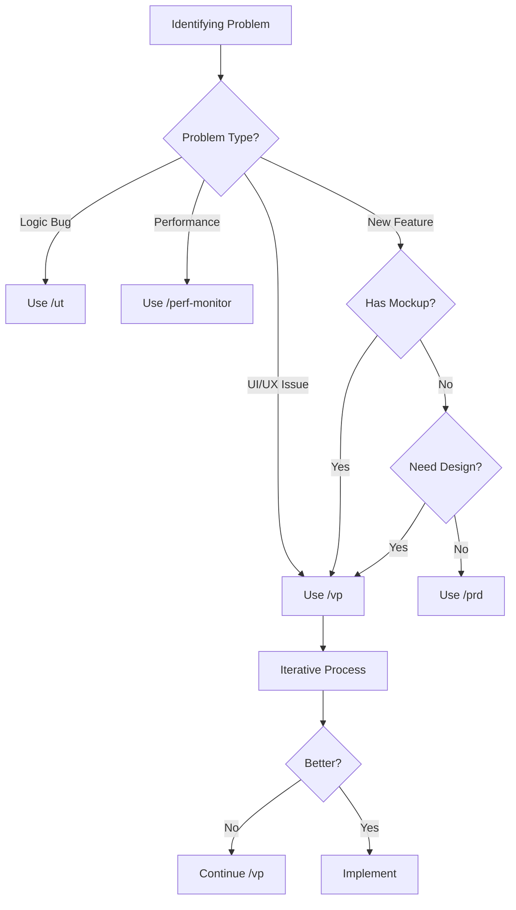
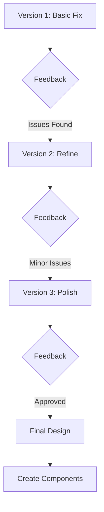

# 🎨 Visual Planning Guide

> Master screenshot-based iterative design with Claude Code's Visual Planning system

## 📋 Table of Contents
1. [Overview](#overview)
2. [When to Use Visual Planning](#when-to-use-visual-planning)
3. [The Visual Planning Workflow](#the-visual-planning-workflow)
4. [Screenshot Best Practices](#screenshot-best-practices)
5. [Iteration Patterns](#iteration-patterns)
6. [Integration with Other Commands](#integration-with-other-commands)
7. [Real-World Examples](#real-world-examples)
8. [Tips & Tricks](#tips--tricks)

## Overview

Visual Planning (`/vp`) enables iterative design through screenshots, allowing you to show Claude exactly what needs improvement and iterate rapidly to the perfect solution.

### Key Benefits
- **Picture worth 1000 words** - Show, don't describe
- **Iterative refinement** - Keep what works, fix what doesn't
- **Design system compliance** - Automatic validation
- **Mobile-first thinking** - Built-in responsive checks
- **Rapid prototyping** - See changes immediately

## When to Use Visual Planning



### Ideal Use Cases

| Scenario | Why Visual Planning | Example |
|----------|-------------------|---------|
| **UI Bugs** | See exact issue | "Button overlapping on mobile" |
| **Design Iteration** | Rapid refinement | "Make dashboard cleaner" |
| **Responsive Issues** | Visual breakpoints | "Fix tablet layout" |
| **Component Design** | See in context | "Design new card component" |
| **User Feedback** | Show actual problems | "Users say this is confusing" |
| **Before/After** | Compare states | "Improve loading state" |

## The Visual Planning Workflow

### Step 1: Initial Setup

```bash
# Start visual planning for a feature
/vp dashboard-redesign

# Claude responds:
"I'll help you plan the dashboard redesign. Please share screenshots 
of the current dashboard showing what needs improvement."
```

### Step 2: Share Screenshots

Methods to share screenshots:
1. **Drag & Drop** - Drag directly into chat
2. **Paste** - Ctrl/Cmd + V after copying
3. **Multiple Views** - Desktop, tablet, mobile
4. **Annotations** - Mark problem areas

### Step 3: Describe Problems

```markdown
Current issues:
1. Cards too close together on mobile
2. Metrics hard to read at a glance
3. No visual hierarchy
4. Inconsistent spacing
5. Poor color contrast on alerts
```

### Step 4: Iterate

```bash
# After Claude's analysis
"keep planning"  # or just "continue"

# Claude provides:
- Specific improvements
- Design system compliance
- Mockup descriptions
- Implementation approach
```

### Step 5: Converge on Solution

```mermaid
flowchart LR
    Start[Initial Screenshot] --> Analyze[Claude Analysis]
    Analyze --> Improve[Improvements]
    Improve --> Show[Show Changes]
    Show --> Feedback{Good?}
    
    Feedback -->|No| Refine[Refine Approach]
    Refine --> Improve
    
    Feedback -->|Yes| Plan[Final Plan]
    Plan --> Implement[/cc components]
```

## Screenshot Best Practices

### What to Capture

| Element | Why Important | How to Capture |
|---------|---------------|----------------|
| **Full Page** | Context | Entire viewport |
| **Problem Areas** | Focus | Zoom on issues |
| **Multiple States** | Completeness | Hover, active, error |
| **Different Devices** | Responsive | Desktop/tablet/mobile |
| **Actual Data** | Realism | Real content, not lorem |
| **Error States** | Edge cases | What breaks |

### Annotation Techniques

```markdown
Good Annotations:
✅ Circle problem areas in red
✅ Add arrows pointing to issues
✅ Number multiple problems
✅ Show ideal spacing/sizing
✅ Highlight good examples

Bad Annotations:
❌ Covering important content
❌ Too many annotations
❌ Unclear markings
❌ No color distinction
```

### Screenshot Tools

**Mac:**
- Cmd + Shift + 4 (area)
- Cmd + Shift + 5 (options)
- CleanShot X (advanced)

**Windows:**
- Win + Shift + S
- Snipping Tool
- ShareX (advanced)

**Browser:**
- Full page capture extensions
- DevTools device mode
- Responsive design mode

## Iteration Patterns

### Pattern 1: Progressive Enhancement



### Pattern 2: A/B Comparison

```bash
# Show two approaches
/vp dashboard-layout

# Share:
# 1. Current dashboard
# 2. Competitor example
# 3. Internal mockup

# Claude analyzes all three and suggests best elements from each
```

### Pattern 3: Mobile-First Iteration

```bash
# Start with mobile
/vp mobile-navigation

# Process:
1. Share mobile screenshot (360px)
2. Fix mobile perfectly
3. Share tablet (768px)  
4. Adapt design
5. Share desktop (1440px)
6. Finalize responsive approach
```

### Pattern 4: Component Evolution

```bash
# Iterating on a component
/vp user-card-component

Iteration 1: Basic layout
Iteration 2: Add avatar, improve spacing
Iteration 3: Add actions, status indicator
Iteration 4: Dark mode variant
Iteration 5: Loading/error states
```

## Integration with Other Commands

### Visual Planning + Component Creation

```bash
# 1. Design with screenshots
/vp new-card-design

# 2. After finalizing design
/cc UserCard --from-vp

# Claude creates component based on visual planning session
```

### Visual Planning + UltraThink

```bash
# Complex UI problem
/ut "analyze dashboard information architecture"

# Then visualize
/vp dashboard-ia

# Combines deep analysis with visual iteration
```

### Visual Planning + Multi-Agent

```bash
# 1. Visual planning session
/vp design-system-updates

# 2. Orchestrate implementation
/orch design-system --agents=3
# Agent 1: Component updates
# Agent 2: Documentation
# Agent 3: Migration guide
```

## Real-World Examples

### Example 1: E-commerce Product Card

```bash
/vp product-card-redesign

# Screenshot 1: Current card
Issues identified:
- Price not prominent
- Add to cart too small
- No hover state
- Reviews hard to see

# Iteration 1: Bigger price, prominent button
"Better, but now feels unbalanced"

# Iteration 2: Adjust proportions, add hover
"Good, but missing quick view"

# Iteration 3: Add quick view icon
"Perfect! Let's also add loading state"

# Final: Complete design ready
/cc ProductCard --from-vp
```

### Example 2: Dashboard Performance Metrics

```bash
/vp performance-dashboard

# Screenshot: Cluttered metrics dashboard

# Claude's analysis:
1. Too many metrics visible at once
2. No visual hierarchy
3. Confusing color scheme
4. Mobile view impossible

# Iteration process:
- Group related metrics
- Establish 3-level hierarchy
- Consistent color for metric types
- Collapsible sections for mobile

# Result: Clean, scannable dashboard
```

### Example 3: Form Error States

```bash
/vp form-error-handling

# Screenshots:
1. Form with no errors
2. Form with single error
3. Form with multiple errors
4. Mobile view with errors

# Improvements through iteration:
- Inline errors below fields
- Summary at top for multiple
- Proper color contrast (red-600)
- Icons for clarity
- Smooth animations
```

## Tips & Tricks

### 1. The "Good Example" Technique

```bash
/vp improve-tables

# Share:
1. Your current table (problem)
2. A good example from elsewhere
3. Ask: "Make mine more like this but following our design system"
```

### 2. The Before/After Method

Always capture the "before" state:
```bash
# Document current state
screenshot current-ui.png

# Run visual planning
/vp improve-ui

# After implementation
screenshot improved-ui.png

# Creates powerful portfolio pieces
```

### 3. Design System Validation

```bash
# During visual planning
"Make sure this follows our design system:"
- Only text-size-1 through 4
- Only font-regular and font-semibold
- 4px grid spacing
- 60/30/10 color rule
```

### 4. Responsive Breakpoints

```bash
# Always test these viewports:
- 360px (mobile)
- 768px (tablet)
- 1024px (desktop)
- 1440px (large desktop)

/vp responsive-layout
# Share all four screenshots
```

### 5. Component States

```bash
/vp button-component

# Share screenshots of:
- Default state
- Hover state
- Active state
- Disabled state
- Loading state
- Error state
```

## Common Pitfalls

### ❌ Avoid These

1. **Vague Descriptions**
   - Bad: "Make it better"
   - Good: "Increase spacing between cards to 16px"

2. **No Context**
   - Bad: Cropped screenshot of button
   - Good: Full page showing button in context

3. **Skipping Iteration**
   - Bad: Accept first suggestion
   - Good: Refine through 3-4 iterations

4. **Ignoring Responsive**
   - Bad: Only desktop screenshots
   - Good: Mobile, tablet, and desktop

5. **Lorem Ipsum Content**
   - Bad: Fake placeholder text
   - Good: Real data to see edge cases

### ✅ Do These Instead

1. **Specific Feedback**
   ```
   "The spacing works but the hierarchy still isn't clear. 
   Can we make the primary metric 40% larger?"
   ```

2. **Show Context**
   - Full page screenshots
   - Include navigation
   - Show scroll position

3. **Embrace Iteration**
   ```bash
   "Good progress. Let's try making the cards 
   slightly wider and adding a subtle shadow"
   ```

4. **Mobile-First Always**
   - Start with mobile constraints
   - Expand to larger screens
   - Test all breakpoints

5. **Real Data Testing**
   - Long names
   - Missing data
   - Error states
   - Loading states

## Advanced Techniques

### 1. Design Token Extraction

```bash
/vp extract-design-tokens

# Share screenshots of existing UI
# Claude identifies:
- Color palette
- Spacing units
- Font sizes
- Border radius
- Shadow styles

# Then: /create-design-tokens
```

### 2. Competitive Analysis

```bash
/vp competitive-analysis

# Share screenshots:
1. Your current design
2. Competitor A
3. Competitor B
4. Industry leader

# Claude provides:
- Best practices from each
- Unique advantages
- Implementation plan
```

### 3. Accessibility Review

```bash
/vp accessibility-audit

# Include screenshots with:
- Color contrast analyzer
- Screen reader view
- Keyboard navigation indicators
- Touch targets highlighted

# Get specific fixes for WCAG compliance
```

## Integration with Development

### From Visual to Code

```bash
# 1. Complete visual planning
/vp feature-design

# 2. Generate implementation plan
/prd-from-vp feature-design

# 3. Create components
/cc-from-vp FeatureComponent

# 4. Validate implementation
/vd
```

### Continuous Visual Testing

```bash
# After implementation
/btf visual-regression

# Playwright captures screenshots
# Compare with visual planning goals
# Ensure pixel-perfect implementation
```

## Summary

Visual Planning is your secret weapon for:
- **Rapid iteration** - See changes immediately
- **Clear communication** - Show exactly what you mean
- **Design system compliance** - Automatic validation
- **Responsive design** - Built-in multi-device thinking
- **Quality results** - Iterate to perfection

Remember: "A screenshot is worth 1000 words, but iteration makes it worth 10000!"

Key commands:
```bash
/vp feature-name        # Start visual planning
"keep planning"         # Continue iteration  
/cc --from-vp          # Create from visual plan
/vp-to-prd             # Convert to PRD
```

Happy designing! 🎨
